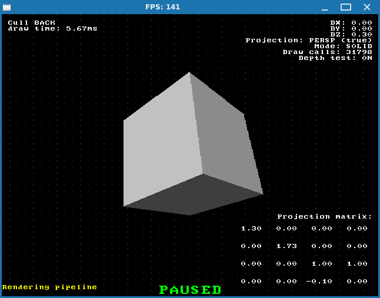

# Software 3D renderer tutorial

At first this project was aimed to be an implementation of things shown in [One Lone Coder](https://github.com/OneLoneCoder) video series called "3D Graphics Engine". But when my project continued to inflate more and more and code comments started to span across several screens I decided that it *might* be a good idea to put all of that knowledge into an article of some sort, so that it can maybe pop out of Internet search to somebody new to 3D graphics who is trying to figure out how everything works.

As it usually happens, when you decide to research some topic of interest you'll end up going down the rabbit hole of different complexity: you start from something simple (in your opinion) but then everything branches out so much that it's possible to get lost. 

This is no exception.

I mean, everybody knows that 3D graphics basically means drawing lots of triangles to the screen. What could possibly be easier? So you go to YouTube and try to find some tutorial videos there (or even text stuff, but who wants to read text?). But what tutorials do you need? How to write your own raytracer? No, that's probably too complicated for a first tutorial project. How to render simple 3D cube? OK, sounds good, but very soon you'll start asking other questions: how does projection work? Why perspective projection matrix is the way it is? And what about shading and textures? 

Lots of questions, but you have to start from somewhere. 

Also, it's obvious that you can't show and explain everything in one YouTube video, for example, so authors end up concentrating on one subject while completely leaving out something else, which could be exactly the thing you're trying to understand right now. And so you quickly find yourself all over the Internet, searching and aggregating bits of information from different sources, trying to make sense of all that at the same time.

In this series of articles I'll try to describe as much "low-level" stuff as possible by going slowly from simple to complicated and with as much detail as possible. We'll be using SDL2 to draw graphics because it's the most "low level" as you can get in a sense that we only can draw pixels to the screen with specified color and that's it. This will also showcase how all 3D stuff gets build from ground up. I'll also be using C++ because all of the learning materials used it, but I guess you can port everything to PyGame or something without much effort. 

Even though English is not my native language I'll write everything in it for 2 reasons:

1. Remember AD&D and what's called *"common language"*? Well, it's quite obvious that English became *that* in our real life. And by obvious reasons also there's overwhelmingly much more actual information available in English regarding IT related topics.
   By writing in a language other than English you write only for those who know it, but by writing in English you write for everyone.

2. `"Понты дороже денег"` which can roughly be translated as "Showing off is priceless". XD

I hope I won't make lots of grammar and spelling mistakes by doing so. )

Any comments / remarks / hints regarding this are appreciated though.

And before I forget, here's the list of sources I used in my research:

- [javidx9 - YouTube](https://www.youtube.com/@javidx9) 
  This is where it all started. Like I mentioned earlier, information is not very detailed in his series about 3D graphics (I believe it was unfinished too), so you'll have to research other topics, which aren't covered, by yourself. But it's a good start.

- [3D Programming Fundamentals [Introduction] Tutorial 0 - YouTube](https://www.youtube.com/watch?v=uehGqieEbus&list=PLqCJpWy5Fohe8ucwhksiv9hTF5sfid8lA) 
  This stuff on the other hand is quite the opposite. The series is extensive, covers pretty much everything, videos are relatively short (for those of you with ADHD), but some things might still be left out. I'd advise watching this some time *after* you research things, though I'll probably be relying mostly on this playlist in my articles.

- [Triangle Rasterization - YouTube](https://www.youtube.com/watch?v=k5wtuKWmV48&pp=ygUWdHJpYW5nbGUgcmFzdGVyaXphdGlvbg%3D%3D) 
  I used rasterization method from this video at 0 iteration of the renderer, if you will, because it's simple. But you'll quickly realize that it might not be the best solution (or even acceptable one). Still, the author covers several important topics as well, so you should definitely watch it.

- [Pinhole and Perspective Projection | Image Formation - YouTube](https://www.youtube.com/watch?v=_EhY31MSbNM) 
  Not related to 3D rendering per se, but still interesting (and maybe useful) material to watch.

- [Bresenham's Line Drawing Algorithm - YouTube](https://www.youtube.com/watch?v=RGB-wlatStc) 
  Now this guy. I was undergoing some algorithmic classes once and had trouble understanding dynamic programming, in particular "0/1 backpack problem". So I googled about it and stumbled across this guy's video, which greatly helped back then. Turns out he also has similar video about infamous Bresenham line drawing algorithm. So if you want to finally understand it, watch it. *(Truth be told: there is still one thing left that I didn't understand, but whatever...)*

- [https://www.scratchapixel.com/index.html](https://www.scratchapixel.com/index.html) 
  A site that did the same thing I'm trying to do here, so I'll just quote from the starting page: `"Teaching computer graphics programming to regular folks"`. Again, not everything might be explained (or in detail that you want), but it's definitely worth looking into.

Well, I guess that's about it. I might update this list in the future if needed, since at the moment of writing of these lines my renderer is still incomplete.

  

[ Next up: Preparations ](p0.md)