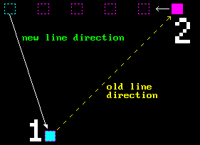

# LINE

OK, before we start doing things with triangles, we need to learn how to draw a line. We'll be using it in the next chapter in actual drawing of triangles, although a bit indirectly. 

We all know what lines are, we saw them hundreds of times while trying to make pixelart or doing any kind of work in graphics editor like Photoshop or GIMP. And I bet you noticed pretty early that graphics editors draw lines in a certain way: if you try to connect two points, line will cover different number of pixels and at a glance the order seems pretty unintuitive, although you can kinda understand the logic behind the pattern.


By definition line is an **infinite** collection of points, but the problem is that our screen is a **discrete** entity: it has **finite** number of points. So, given a line, we need to decide which pixels to light up along its "path". 

Enter the `"Bresenham algorithm"`.

I guess as soon as it became possible to draw stuff on the screen in the past people started to think about how to draw primitive shapes, one of which is a line. Wikipedia says that this algorithm was developed back in `1962` by the guy after which it is named - [Jack Elton Bresenham](https://en.wikipedia.org/wiki/Bresenham%27s_line_algorithm) - so I say it was pretty long time ago. And the fact that it's still actively used today shows its fundamental nature.

Main idea of the algorithm is pretty simple - you must light those pixels which are the closest to "real" points on "real" (mathematical) line.


OK, so let's implement this.

But hold on, one may ask: "Why do we have to deal with some algorithm from the past? Can't we just use line equation and light pixels at points which come up from the euation?". So, let's actually try it and see what happens. Let's call it "head-on approach".

### Head-on approach

So in order to draw a line we need two points, $P_1(x, y)$ and $P_2(x, y)$.

Now we must find corresponding line equation that goes through these two points. Let's recall line equation first:

$$
y = kx + b
$$

where $k = \frac{dy}{dx}$ or what's sometimes called "rise over run". I'll be using different variable names because that's what we use here, but it shouldn't matter.

And you can already see the problem in $k$: division by zero in case of a vertical line. But that can easily be solved by handling this edge case separately, so let's continue.

Let's also recall what $k$ means:


Thus when $k > 1$ line has **steep** slope, while when $k < 1$ it has **gentle** slope. This will be important later.

Now, given our two points we can calculate $k$ like so:

$$
k = \frac{(P_2.y - P_1.y)}{(P_2.x - P_1.x)}
$$

The only thing left to calculate is $b$, but it can be easily done by plugging in the equation values of any point in place of $x$ and $y$ and then expressing $b$. Let's pick $P_1$:

$$
y = kx + b
$$

$$
b = y - kx
$$

$$
b = P1.y - \frac{(P_2.y-P_1.y)}{(P_2.x-P_1.x)}P_1.x
$$

And there you have it. The only thing left now is to iterate from $P_1$ to $P_2$, calculate $y$ along the way and plot corresponding pixel.

It may look something like this:

```cpp
double k = (double)dy / (double)dx;
double b = (double)y2 - (double)x2 * k;

for (int i = loopStart; i <= loopEnd; i++)
{
  int y = (int)(k * i + b);
  SDL_RenderDrawPoint(_renderer, i, y);
}
```

Again, ignore for now the fact that `dx` can be 0.

But of course it's not that simple.

What the values of `loopStart` and `loopEnd` should be? Obviously, from code snippet above it's X component of first and second point correspondingly. But actually we have several issues to consider:

1. Points can be specified in any order.

2. Leading to the next problem: line can go in four directions total, depending on points order.

3. Line can have steep or gentle slope (which is determined by $k$), which means that we need to iterate across different range of points: if line has gentle slope it will have more X values than Y values, so we should iterate across X and calculate Y, and vice versa.

So let's deal with the problems in order.

Since we only have two points it's easy to force them to be in specific order by sorting them, like so:

```cpp
if (x1 > x2)
{
  std::swap(x1, x2);
  std::swap(y1, y2);
}
```

Thus our first point will always be the one with the smallest X component.

Let's think about next step. Since our first point now is always fixed, so to speak, our line can actually go in two directions instead of four:


If we start to move, for example, point 2 to the left, as soon as it crosses point 1 it now **becomes** point 1. And again we will have point 1 the leftmost and point 2 the rightmost:



The only question left now is to consider line's slope. With just two cases it's actually easy: if line has gentle slope we should go across X, and if it has steep slope we should go across Y.

```cpp
double k = 0;
if (dx != 0)
{
  k = (double)dy / (double)dx;
}

bool steep = std::abs(dy) > std::abs(dx);

int loopStart = steep ? y1 : x1;
int loopEnd   = steep ? y2 : x2;

if (loopStart > loopEnd)
{
  std::swap(loopStart, loopEnd);
}
```

And in order for our for loop to work we need to check that its start and end points are in order. That's why we perform additional swap in case `loopStart` is greater than `loopEnd`, which can happen if line is steep since in that case we need to iterate across Y, but our `y1` could be either above or below `y2`.

Now we can just iterate through start and end points, rewriting line equation to derive either new X or familiar Y points:

```cpp
for (int i = loopStart; i <= loopEnd; i++)
{
  if (steep)
  {
    int x = (int)(i - b) / k;
    SDL_RenderDrawPoint(_renderer, x, i);
  }
  else
  {
    int y = (int)(k * i + b);
    SDL_RenderDrawPoint(_renderer, i, y);
  }
}
```

And it will work. The problem is that the result is not so good. See what happens if we try to move one point to the left for just one unit across X:


Suddenly we have pixels popping out in places we don't expect them to. Same thing happens if we try to move second point to the right in certain configurations:


The whole line gets sort of shifted up and to the right.

Why does this happen?

The answer is pretty simple: floating point. By using "real" line equation we're calculating true point of a line, but then we're snapping to whatever pixel that happens to be there when we cast the result to `int`. 

That's one of the reasons why people use Bresenham algorithm - to avoid floating point calculations. Another reason is that floating point math was expensive for CPU back in the day, the issue that is not _that_ important nowadays.

Also, by doing everything in integer domain we ensure stability - if line goes from point A to point B, it **must** start at point A and end up at point B.

You _could_ do drawing in floating point domain (Google about "subpixel precision"), but we won't for simplicity sake. We'll go full PlayStation 1 style and avoid floating point calculations. :-)

Well, time to check out how it's done then.

### Bresenham Algorithm

Let's again recall main characteristics a line:


With line equation being:

$$
y = kx + b
$$

where obviously:

$$
k = \frac{dy}{dx}
$$

$$
dy = y_2 - y_1
$$

$$
dx = x_2 - x_1
$$

If we remember `SOHCAHTOA`, we can see that $k=\frac{dy}{dx}=tan(a)$.

Thus, if $k=1$ then angle is $45^{\circ}$. If $k<1$ then our line has **gentle** slope, and if $k>1$ it has **steep** slope.

We need to determine which pixel to turn on in case when our true line intersects both of them, like so:


To answer that we're going to cheat a little bit.

Let's imagine that between those "questionable" pixels there is another one called $T$ (don't pay _much_ attention to the accuracy of the image):


Like it was mentioned, idea of Bresenham algorithm is to to light up those pixels whose distance to the "real" one is the smallest. So we just need to find distance between `5` and `T` ($d_1$) and from `2` to `T` ($d_2$) and choose the smallest of them.

For simplicity's sake let's consider that our line has $k<1$ for now. For $k>=1$ it's just a matter of swapping some variables (more on that later).

So, since our $k<1$ we will iterate from $x_1$ to $x_2$ because we have more points across $X$ axis. So our $x$ will always increase when we traverse from $x_1$ to $x_2$, but whether $y$ should increase or not, given any $x$ sample, that's what we'll have to decide. 

Let's call this pixel-to-be-decided's $x$ coordinate $X_{next}$:

$$
X_{next}=X_k+1
$$

We're interested in what $y$ we should choose for point $X_k + 1$, whether it will remain $Y_k$ or it will be $Y_k+1$.

$$
Y_{next}=\begin{cases}
Y_k \\
Y_k + 1
\end{cases}
$$

Our line equation for point $T$ is this:

$$
Y_t=k(X_k+1)+b
$$

Let's find out $d_1$ and $d_2$:

$$
\begin{align*}
d_1&=Y_t-Y_k \\
d_2&=(Y_k+1)-Y_t
\end{align*}
$$

Now let's plug in $Y_t$:

$$
\begin{align*}
d_1 &=k(X_k+1)+b-Y_k \\
d_2 &=(Y_k+1)-[k(X_k+1)+b]=Y_k+1-k(X_k+1)-b 

\end{align*}
$$

So, if $(d_1-d_2)<0$ then our value $y$ for this $x$ sample should remain as $Y_k$.

If $(d1-d2)>=0$ then our value $y$ for this $x$ sample should become $Y_k+1$.

Let's actually subtract $d_1$ and $d_2$:

$$
(d_1-d_2)=[k(X_k + 1) + b - Y_k] - [Y_k + 1 - k(X_k+1) - b]
$$

Open up the brackets:

$$
(d_1-d_2) =\underline{\underline{k(Xk+1)}} + \utilde{b}\;\underline{-Y_k}\;\underline{-Y_k} - 1 + \underline{\underline{k(X_k+1)}} + \utilde{b}

$$

Let's group highlighted things:

$$
(d_1-d_2)=2k(X_k+1)-2Y_k+2b-1
$$

We still have $k$ in our equation, which is $\frac{dy}{dx}$. But we set out to get rid of floating point calculations. To do that we will just multiply the whole thing by $dx$:

$$
\begin{align*}
dx*(d_1-d_2) &= dx*[2\frac{dy}{dx}(X_k+1)-2Y_k+2b-1] \\
dx*(d_1-d_2) &= 2dy(X_k+1)-2dxY_k + 2dxb-dx
\end{align*}
$$

Let's call this whole thing "decision parameter" and assign it to variable $P_k$ and also open up the brackets:

$$
dx*(d_1-d_2)=2dyX_k+\underline{2dy}-2dxY_k+\underline{2dxb}-\underline{dx}=P_k
$$

We can observe that highlighted variables are constant. So we can discard them as irrelevant because we're only interested in terms that depend on $X_k$ and $Y_k$.

So we're left with:

$$
P_k=2dyX_k-2dxY_k
$$

Now let's write $P_k$ for general case:

$$
P_{next}=2dyX_{next}-2dxY_{next}
$$

$X_{next}$ is always ${X_k+1}$ because, like it was said, we're currently dealing with a line with $k<1$. But value of $Y_{next}$ we'll have to find out. By subtracting $(P_{next}-P_k)$ we can find out how much a decision variable should change at every iteration.

$$
\begin{align*}
(P_{next}-P_k) &= (2dyX_{next}-2dxY_{next})-(2dyX_k-2dxY_k) \\
(P_{next}-P_k) &= 2dyX_{next}-2dxY_{next}-2dyX_k+2dxY_k
\end{align*}
$$

Factor out stuff:

$$
(P_{next}-P_k)=2dy(X_{next}-X_k)-2dx(Y_{next}-Y_k)
$$

If $(P_{next}-P_k)<0$ then we should remain on the same $Y_k$, so $Y_{next}=Y_k$. 

$x$ is always increasing, so $X_{next}=X_k+1$:

$$
P_{next}=P_k+2dy(X_k+1-X_k)-2dx(Y_k-Y_k)
$$

Cancel out $X_k$ and $Y_k$:

$$
\boxed{P_{next}=P_k+2dy}
$$

If $(P_{next}-P_k)>=0$ then $Y_{next}=Y_k+1$. 

$X_{next}$ is still $X_k+1$. So we'll get:

$$
P_{next}=P_k+2dy(X_k+1-X_k)-2dx(Y_k+1-Y_k)
$$

Again, stuff gets cancelled:

$$
\boxed{P_{next}=P_k+2dy-2dx}
$$

The only thing left is to calculate initial value for $P_k$. To do this recall initial formula where we discarded constant variables:

$$
P_k=2dyX_k+2dy-2dxY_k+2dxb-dx
$$

This time, for calculation of initial value, we will use full form of the equation. First we need to remove constant $b$. To do that we can express $b$ from line equation:

$$
\begin{align*}
y &= kx+b \\
b &= y-kx = y-\frac{dy}{dx}x
\end{align*}
$$

Now let's plug it in the formula for $P_k$ above:

$$
P_k=2dyX_k+2dy-2dxY_k+2dx(y-\frac{dy}{dx}x)-dx
$$

For starting point let's call $x=X_1$ and $y=Y_1$ and also open up brackets:

$$
P_{k_1}=\underline{\underline{2dyX_1}}+2dy-\underline{2dxY_1}+\underline{2dxY_1}-\underline{\underline{2dyX_1}}-dx
$$

$$
\boxed{P_{k_1}=2dy-dx}
$$

Now we have everything we need to actually implement the algorithm.

### "Later" stuff

Somewhere in the beginning of the previous part it was mentioned that for simplicity's sake we'll consider only a line with $k<1$ and that for other cases it's just a matter of swapping of some variables and "more on that later".

Well, **not** is "later".

First, let's consider the following two equations:

$$
\begin{align}
y &= 10x \\
y &= 0.1x
\end{align}
$$

It's pretty obvious that these lines are mirrored across axis $y=x$ and in order to create mirrored line we just need to invert $k$, i.e. $k=\frac{1}{k}$ or $\frac{1}{\frac{dy}{dx}}=\frac{dx}{dy}$.

So whenever we have a line with $k>1$ we can convert it to the mirrored version which will have $k<1$ by swapping $y$ from $(1)$ as $x$ for $(2)$:

```
1)                2)  
x = 0.01    +---> x = 0.1
            |
y = 0.1  ---+     y = 0.01
(0.01, 0.1)       (0.1, 0.01)
```

Thus we kinda reduced the problem to already solved one.

Now notice that when $k<1$ it means that we have more $x$ values than $y$ and $y$ values are the ones that we need to determine whether to increment or not during rasterization loop. So by checking the $k$ value beforehand we can create two execution branches that will increment either $x$ constantly and determine $y$ or vice versa. 

How exactly? 

If we have a line with $k>1$ we'll mirror it and then use the same calculations as usual, but when we will actually draw stuff we will iterate over $Y$ axis instead of $X$ and increment $x$ (or not) instead of $y$, and since everything is a mirror image it will all work out nicely.

Edge cases when line is vertical ($dx = 0$) and horizontal ($dy = 0$) can be handled separately, but we actually don't need to do that since at those cases everything will work in the code by itself.

This leaves the last question: direction of a line.

If we sort points by $x$ we can then have only two cases:

1. Line goes up.

2. Line goes down.

So by finding out which type of line is in our case we can then determine whether we need to increment $y$ or decrement it.

```cpp
void BresenhamHindu(int xs, int ys, int xe, int ye)
{
  int x1 = xs;
  int y1 = ys;
  int x2 = xe;
  int y2 = ye;

  //
  // Sort by X so that starting point is always the left one.
  //
  if (x1 > x2)
  {
    std::swap(x1, x2);
    std::swap(y1, y2);
  }

  xStart = x1;
  yStart = y1;

  xEnd = x2;
  yEnd = y2;

  bool goesDown = (y2 > y1);

  //
  // These will be our pixel coordinates to fill.
  // Prime them with starting point.
  //
  int x = x1;
  int y = y1;

  int dx = std::abs(x2 - x1);
  int dy = std::abs(y2 - y1);

  //
  // Let's try to avoid any floating point calculation: if k > 1 then it
  // means that dy is greater than dx, so our line slope is "steep", that is
  // its angle is greater than 45 degrees. Otherwise we'll consider line
  // slope to be "gentle".
  //
  bool steep = (dy > dx);

  //
  // If line is steep convert it to gentle by inverting k.
  //
  if (steep)
  {
    std::swap(dx, dy);
  }

  //
  // Initial value for Pk (Pk1 in the longread above).
  //
  int P = 2 * dy - dx;

  SDL_SetRenderDrawColor(_renderer, 255, 0, 0, 255);

  //
  // Gentle slope, everything goes as planned.
  //
  if (not steep)
  {
    //
    // This will always work because points are sorted by X.
    //
    while (x != x2)
    {
      SDL_RenderDrawPoint(_renderer, x, y);

      x++;

      //
      // Our decision parameter.
      //
      // If line is horizontal (dy = 0) we will always go into (P < 0)
      // branch thus not affecting Y at all (check that initial value of
      // P = 2 * dy - dx).
      //
      if (P < 0)
      {
        P += 2 * dy;
      }
      else
      {
        P += 2 * dy - 2 * dx;
        y = goesDown ? (y + 1) : (y - 1);
      }
    }
  }
  else
  {
    //
    // If line is steep just swap stuff around. This time we're going across
    // Y axis and must determine whether to increase X or not. Notice that
    // decision parameter calculation remained the same but it actually is
    // working on mirrored line but doesn't know about it. :-)
    //
    while (y != y2)
    {
      SDL_RenderDrawPoint(_renderer, x, y);

      //
      // This time Y is always incremented (or decremented, depending on
      // line direction).
      //
      y = goesDown ? (y + 1) : (y - 1);

      //
      // Same here, if line is vertical (dx = 0), we will go into this
      // branch (remember, that dx and dy get swapped if line is steep).
      //
      if (P < 0)
      {
        P += 2 * dy;
      }
      else
      {
        P += 2 * dy - 2 * dx;
        x++;
      }
    }
  }
}
```

The result is much better compared to the "head-on" approach:


See [example project](../tests/bresenham-hindu/) for more detail and examples of other line drawing algorithms.

With that out of the way, let's finally proceed to the next step.

<br>

<br>

[ Next up: Triangle ](p2.md)
