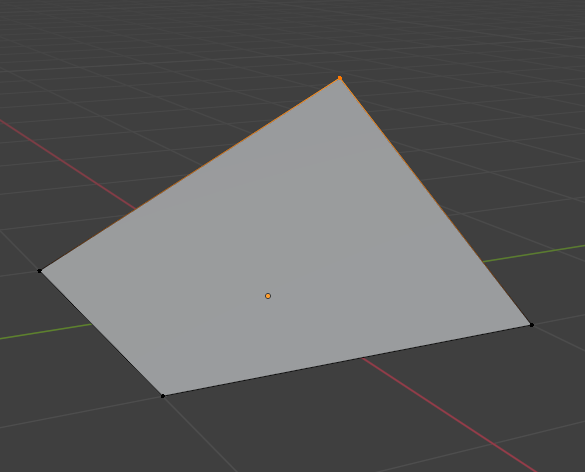

# TRIANGLE

> _"What is a man? A miserable little pile of secrets!"_
> 
> Dracula, "Castlevania: Symphony of the Night"

Indeed, what is a triangle? 

And why it's such a big deal? Can't you do 3D graphics without triangles?

Of course you can. One notable example is [Sega Saturn](https://en.wikipedia.org/wiki/Sega_Saturn) that used quads to render 3D. This doesn't mean that Sega Saturn couldn't draw triangles - it just used a quad as its main rendering primitive. And before you start wondering, it was backed by Nvidia back then. I'm pretty sure that [earliest examples of 3D graphics](https://www.youtube.com/watch?v=fAhyBfLFyNA) also used triangles (well, for the most part at least). So why rectangles then? Well, one of the explanations is that this was done to achieve maximum performance for drawing tile-based scenes, i.e. 2D sprites. It was sort of an inertia from the times of NES and SNES, which used tile-based rendering of sprites.

But eventually everybody kinda silently agreed on triangles and for obvious reason: it's the simplest polygon possible. Triangle is unambiguously defined by any 3 points and they always reside on the same plane in space, while with quads you could get for example this:

TODO
