# TRIANGLE

> _"What is a man? A miserable little pile of secrets!"_
> 
> Dracula, "Castlevania: Symphony of the Night"

Indeed, what is a triangle? 

And why it's such a big deal? Can't you do 3D graphics without triangles?

Of course you can. One notable example is [Sega Saturn](https://en.wikipedia.org/wiki/Sega_Saturn) that used quads to render 3D. This doesn't mean that Sega Saturn couldn't draw triangles - it just used quad as its main rendering primitive. And before you start wondering, it was backed by none other than Nvidia back then. I'm pretty sure that [earliest examples of 3D graphics](https://www.youtube.com/watch?v=fAhyBfLFyNA) also used triangles (well, for the most part at least, as far as I can tell from the video). So why rectangles then? Well, one of the explanations is that this was done to achieve performance in drawing tile-based scenes, i.e. 2D sprites. It was sort of an inertia from the times of NES and SNES, which used tile-based rendering of sprites.

But eventually everybody kinda silently agreed on triangles and for obvious reason: it's the simplest polygon possible. Triangle is unambiguously defined by any 3 points and they always reside on the same plane in space, while with quads you could get for example this:


So now we know that any 3D model (no matter how fancy) is actually consisting of lots of triangles. Thus, before we start drawing such 3D models we need to learn how to draw triangles first.

There probably exist more than 1 way to rasterize a triangle. I will mention just two:

1. Point-In-Triangle rasterizer (or what I cleverly dubbed `P.I.T. rasterizer` ;-))

2. Scanline rasterizer

### P.I.T. rasterizer

This method is very simple: given 3 points of a triangle we determine bounding box that surrounds it, and then iterate across it pixelwise, checking whether pixel falls inside the triangle or not.

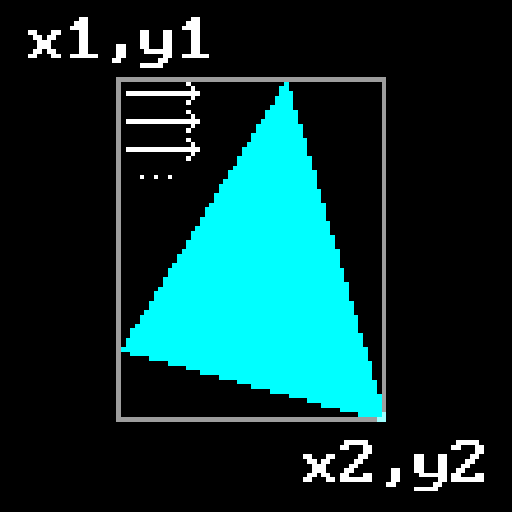

To determine whether point falls inside the triangle or not we'll use what's sometimes called `2D cross product`, but actually it's just a normal cross product with `Z` set to 0. One can easily memorize how to perform a cross product on two vectors if you'll associate the word `cross` with the following mnemonic:

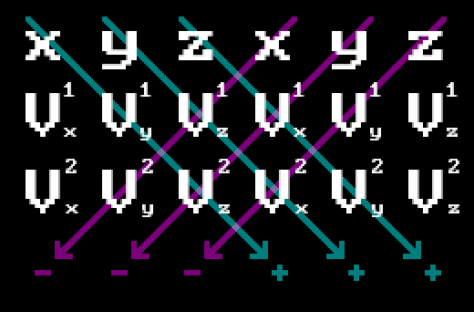

Thus we will have:

$$
\vec{V_1} \times \vec{V_2} = (V^1_yV^2_z-V^1_zV^2_y,\;V^1_zV^2_x-V^1_xV^2_z,\;V^1_xV^2_y-V^1_yV^2_x)
$$

You can see that by setting $z$ to 0 you'll be left with:

$$
\vec{V_1} \times \vec{V_2}=(0,\;0,\;V^1_xV^2_y-V^1_yV^2_x)
$$

Since right now we're doing 2D and not interested in this being interpreted as a 3D vector (you can think of it as a vector going outside / inside the screen, if you like), we can just use the last component as a scalar value:

```cpp
double CrossProduct2D(const Vec3& v1, const Vec3& v2)
{
  return (v1.X * v2.Y - v1.Y * v2.X);
}
```

Let's recall that the result of a cross product differs by sign depending on the order of operations:

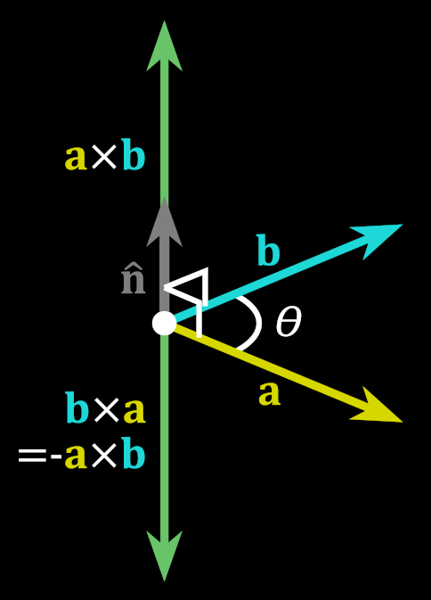

We can use this fact to determine whether a point lies inside the triangle or not. To do this we need to check the sign of a cross product of every triangle edge with a vector that goes from triangle vertex to the point in question. 

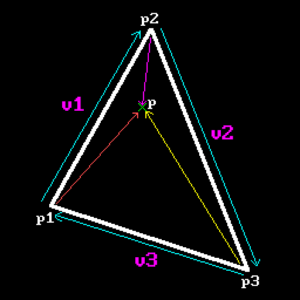

$$
\begin{align*}
&w_0 = \vec{v_1}\times{\overrightarrow{red}} = \\
&= (p_2.x-p_1.x)*(p.y-p_1.y)-(p_2.y-p_1.y)*(p.x-p_1.x)\\
&w_1 = \vec{v_2}\times{\overrightarrow{magenta}} = \\ 
&= (p_3.x-p_2.x)*(p.y-p_2.y)-(p_3.y-p_2.y)*(p.x-p_2.x) \\
&w_2=\vec{v_3}\times{\overrightarrow{yellow}} = \\
&=(p_1.x-p_3.x)*(p.y-p_3.y)-(p_1.y-p_3.y)*(p.x-p_3.x)
\end{align*}

$$

You can see that if point lies inside the triangle, all cross products are performed "clockwise": edge multiplied by the vector to the point goes in sort of clockwise direction, so they all will have the same sign. Should a point lie outside the triangle, at least one of the products will go "different way" and will have opposite sign. 

Which actually brings us to the next important topic: `winding order`. This means the order in which triangle vertices are specified. It can either be in **clockwise** (`CW`) or **counterclockwise** (`CCW`) order.

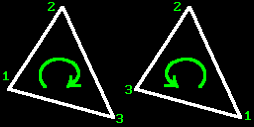 

Since user can specify triangle vertices in any order, we can't pre-agree on certain sign of the cross product to check against. But since all that we need to do is check whether all products yield the same sign or not, this will work anyway. But later you will see that winding order actually **does** matter.

So our main piece of code will look like this:

```cpp
for (int x = xMin; x <= xMax; x++)
{
  for (int y = yMin; y <= yMax; y++)
  {
    SDL_Point p = { x, y };

    //
    // It seems that if we don't use a function call (CrossProduct2D) 
    // and just perform calculations directly, this way it works a 
    // little bit faster.
    //
    int w0 = (p2.x - p1.x) * (p.y - p1.y) - (p2.y - p1.y) * (p.x - p1.x);
    int w1 = (p3.x - p2.x) * (p.y - p2.y) - (p3.y - p2.y) * (p.x - p2.x);
    int w2 = (p1.x - p3.x) * (p.y - p3.y) - (p1.y - p3.y) * (p.x - p3.x);

    bool inside = (w0 <= 0 and w1 <= 0 and w2 <= 0)
               or (w0 >= 0 and w1 >= 0 and w2 >= 0);

    if (inside)
    {
      SDL_RenderDrawPoint(_renderer, p.x, p.y);
    }
  }
}
```

And there you have it - perfectly working triangle rasterization method. As you can see it's very simple and straightforward. Check [example project](https://github.com/xterminal86/sw3d/tree/main/tests/pit-rasterizer) to see how it works.

But it has two flaws: 

1. Even though not that critically important nowadays, we still perform a lot of multiplications per pixel. Which kinda matters because of the next point:

2. Exactly half of work cycles are wasted because we're looping across the bounding box, which area is twice that of the triangle. So half the time we're performing all those cross product calculations for nothing.

So we're going to implement a different rasterization method, which doesn't waste work and also more interesting in general (at least in my opinion :-)). 

### Scanline rasterizer

If you actually think about it, aside from degenerate cases like a line or a point, any triangle can belong to one of the three categories, one of which can be further divided into two more. But both of them contain previous two (I marked it with a dashed line for clarity), so we have four categories in total:

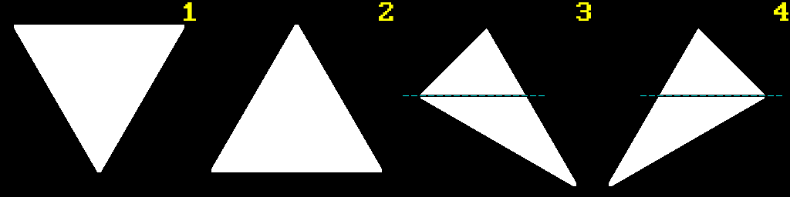

We will call these:

1. **Flat Top (FT)** triangle

2. **Flat Bottom (FB)** triangle

3. **Composite Major Right (CMR)** triangle

4. **Composite Major Left (CML)** triangle

As you can clearly see, CMR and CML triangles consist of FB and FT triangles if looking from top to bottom (let's call them `basic triangles`). Thus, in general every non-degenerate triangle can be represented by either FT or FB triangle. So what we need to do is find out which type of triangle is before us and then perform `scanline rasterization` by filling in pixels going left to right, top to bottom across triangle's edges, like so:


To do that we will use our old friend from previous chapter - `Bresenham algorithm`. Remember earlier I said that we will use it, but a bit indirectly? What I meant is that we're not going to use it to draw lines with it - we're going to use it to get points across edges of corresponding triangle, and then we will connect them horizontally at each $Y$ pixel position (that's what the word `scanline` stands for).

Let's recall that our line drawing algorithm has certain quirk, so to speak: it swaps points depending on the line's slope. And the side effect of this is that our first point might be either above or below the second:

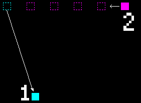

But since we're planning on doing scanline rasterization, it would be more convenient to always have first point above the second. That's actually easy to do - we just need to sort line points by $Y$ instead of $X$ and then basically swap everything inside the algorithm. I'll leave that as an excercise to the reader. Start with the similar setup as the original one, but this time consider line with steep slope as your "base case", and then just follow along with the whole line of thinking from previous chapter again and you'll be fine.

And to make our life easier let's wrap that in generator-like class that is initialized with start and end points, and returns next point for a potential line when called, like this: 

```cpp
BLG bg;

bg.Init(x1, y1, x2, y2);

BLG::Point* p = bg.Next();
while (p != nullptr)
{
  printf("(%d, %d)\n", p->first, p->second);
  p = bg.Next();
}
```

See implementation and example [here](https://github.com/xterminal86/sw3d/tree/main/tests/bresenham-generator).

Then we can use two instances of such class to create two generators that will return corresponding points of a triangle's edges that we need to connect.

Now that we've prepared everything, let's continue with the triangle.

But first I have to warn you: there will be a lot of text and it might look complicated, but by complicated I don't mean that it will be hard to understand or anything. It's just I think that this will be a great example of how a problem that is simple at first glance becomes overgrown with lots of details that you might've not known or thought about.

First order of business, we must address the issue of - once again - `winding order`. This time it will matter though because it will determine all cases that we need to consider during rasterization. Usually when it comes to winding order one has to choose one. It _usually_ doesn't matter which one is chosen, as long as the desired selection is consistent across everything. This is exactly the case here.

So why we need to consider winding order then?

The problem is basically the same as in the case for a line: vertices can be in any order. But in order for our algorithm to work we need to have **specific** order of vertices. Let's actually write down steps of our scanline rasterization algorithm for a FB triangle (pay no mind to the winding order in a picture for now):

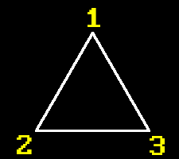

    1. Start from point 1
    2. Construct two BLG generators: 1-2 and 1-3
    3. For each scanline
       (1.y to 2.y [or 3.y since they're the same]):
       3.1 Get next point from first generator until its Y
           changes from the current scanline value.
       3.2 Get next point from second generator until its Y
           changes from the current scanline value.
       3.3 Connect generator points.

But what if vertices were specified in different order? What if points were "bit shifted" (first becomes second, second becomes third and third becomes first) for both CW and CCW order?

And remember, all of this is just for one type of triangle.

I guess theoretically you could just write code for every possible scenario, but that will be a nightmare and kinda unprofessional. Like, do we **really** have no choice but to manually go through all possible cases? Spoiler alert: of course not. So let's think about it.

Is it possible to somehow enforce winding order? Well, actually it is. You can't do that in 3D because there's always the "other" side, so whatever is CW looking from the "front", it's CCW looking from the "back". But here we're in 2D space, so there's no "other" side. So what we need to do is the same in principle as in case of a line: we need to sort vertices and swap some of them if needed. The only thing different now is that we need to decide upon winding order that we're going to use here. Along with sorting, this will allow us to automatically arrange points in specific order for both "basic triangle" types, regardless of the order in which their original points were specified. Then we can rely on this during actual drawing. Doing just sorting alone won't be enough as you will see a bit further below.

Let's pick `CW` order because it seems that it's the one that is used across all learning materials that I encountered regarding this topic. And honestly CW is kinda more easy to the mind: on the screen $(0;0)$ is at the top-left corner and $x$ and $y$ go left to right, top to bottom, so CW ordering feels more natural here. 

Sure, one could say that by choosing the same winding order for both 2D and 3D we would attain sort of a consistency (that's actually exactly what I contemplated about for a bit), but it really is just a matter of preference, and winding order for 3D is not related **at all** to the order that we can choose for 2D rasterization, so let's not make our life harder than it already is. ;-) 

But if you do want to complicate your life and choose another winding, you probably already guessed that you would just need to "flip everything" around that is shown in the example.

OK, so we settled on CW winding. How do we enforce it?

Well, first of all, let's actually find out current winding order of a given triangle. To do that we will ask for help from our another old friend - `cross product`. Let's again look carefully at a triangle:


To determine current winding order all we have to do is note that if we take a cross product of vectors 1-2 and 2-3, it will yield different sign depending on the order of vertices. 

```cpp
WindingOrder GetWindingOrder(const TriangleSimple& t)
{
  double cp = CrossProduct2D(t.Points[1] - t.Points[0],
                             t.Points[2] - t.Points[1]);

  return cp > 0 ? WindingOrder::CW : WindingOrder::CCW;
}
```

Where `WindingOrder` is just a simple `enum`:

```cpp
enum class WindingOrder
{
  CW = 0,
  CCW
};
```

This triangle has CCW winding order, obviously, and we need CW. But you can see that winding order changes if we swap any of the two vertices:

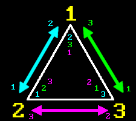

So, after we find out winding order of a triangle, we can check if it's the one we need, and "fix" it if it's not. So let's put all of that in a helper function:

```cpp
void CheckAndFixWinding(TriangleSimple& t)
{
  WindingOrder wo = GetWindingOrder(t);
  if (wo == WindingOrder::CCW)
  {
    //
    // Since we decided to stick to CW winding order if we encountered CCW one
    // just swap two adjacent vertices to change it.
    // We will swap 2nd and 3rd because we decided on certain configurations
    // of vertices for all triangle types.
    //
    std::swap(t.Points[1].X, t.Points[2].X);
    std::swap(t.Points[1].Y, t.Points[2].Y);
  }
}
```

As you can see from the comment, we will swap second and third vertex and not just any random two, because we need specific "base" vertex configurations for all triangle variants. 

What do I mean by that?

Recall our triangle variants from before:  


In order to rasterize them not only do we need to have a specific winding, but we also need to decide on the **enumeration** of vertices: which one will be first, which one second and which one third. By sorting vertices $Y$ first and $X$ second, we will ensure following possible vertex enumerations:

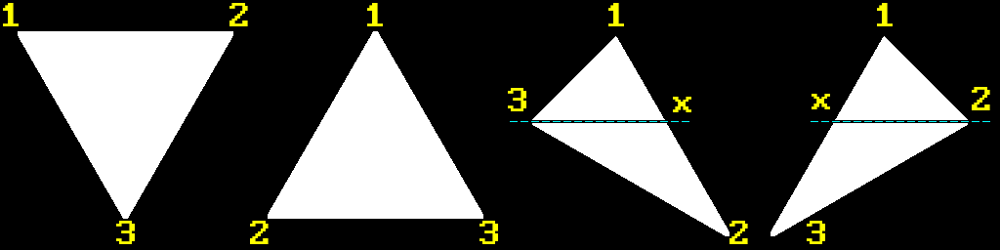

Because we desire `CW` ordering we need to swap vertices `2 <---> 3` for `FB`. Also, by doing so we ensure that point `1` is always at the top. That's why we used point 2 and 3 for swapping in `CheckAndFixWinding()` function. Later in actual code that fills a triangle we'll use three points as arguments to a concrete function specific to the certain triangle type, ordering of which will be expected. And since our sorting and winding correction will end up with one unambiguous result, we can manually pass those points into this concrete function in proper order. So you see, it's everything about order here.

We still need to find splitting point `x` to be able to rasterize composite triangle using two basic ones.

From CMR we can designate:

$$
\frac{v_3.y-v_1.y}{v_2.y-v_1.y}=a
$$

From this equation splitting point $x$ can be defined as:

$$
x=(1-a)v_1 + av_2
$$

which looks suspiciously similar to `linear interpolation`.

We can rewrite this expression as:

$$
x = v_1-av_1 + av_2=v_1 + av_2 - av_1
$$

$$
\boxed{x=v_1+a(v_2-v_1)}
$$

And with that, here's how our main rasterization function looks like:

```cpp
void FillTriangleCustom(TriangleSimple& t)
{
  SortVertices(t);
  CheckAndFixWinding(t);

  TriangleType tt = GetTriangleType(t);
  switch (tt)
  {
    case TriangleType::VERTICAL_LINE:
      DrawVL(t);
      break;

    case TriangleType::HORIZONTAL_LINE:
      DrawHL(t);
      break;

    case TriangleType::FLAT_TOP:
      DrawFT(t);
      break;

    case TriangleType::FLAT_BOTTOM:
      DrawFB(t);
      break;

    case TriangleType::MAJOR_RIGHT:
      DrawMR(t);
      break;

    case TriangleType::MAJOR_LEFT:
      DrawML(t);
      break;

    default:
      break;
  }
}
```

We're also handling two edge cases here when triangle has degenerated into a line, but they're trivial to implement, so I won't be showing them here. Instead let's look at `DrawFT()` for rasterization of a flat top triangle:

```cpp
void DrawFT(const TriangleSimple& t)
{
  //
  // Vertices in 't' are always:
  //
  // 1     2
  //
  //
  //    3
  //
  BLG first;
  first.Init(t.Points[0].X, t.Points[0].Y, t.Points[2].X, t.Points[2].Y);

  BLG second;
  second.Init(t.Points[1].X, t.Points[1].Y, t.Points[2].X, t.Points[2].Y);

  if (Wireframe)
  {
    RasterizeWireframe(first, second, t, TriangleType::FLAT_TOP);
  }
  else
  {
    Rasterize(first, second, t, TriangleType::FLAT_TOP);
  }
}
```

As you can see, our sorting and widing fixing allowed us to rely on specific order of vertices that come into this function. Then we can prime two generators for two corresponding edges: 1-3 and 2-3. Again, you can see that there's another convenient method present for drawing wireframe triangle, but we're also going to skip it since it's trivial and not important for this topic.

Now, `Rasterize()` is where things get real. This function contains code for rasterization of both FT and FB triangles. But before checking it out we need to address another issue.

Generally it's obvious that during scanline rasterization loop we need to connect leftmost points of the left line with rightmost points of the right line, like so:

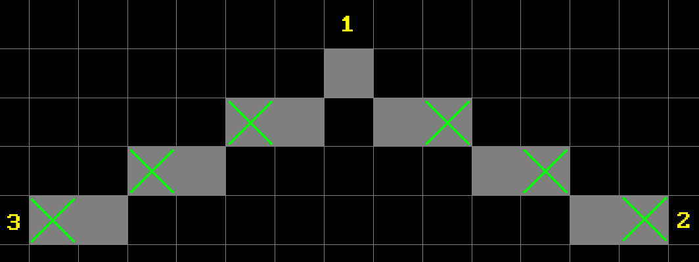

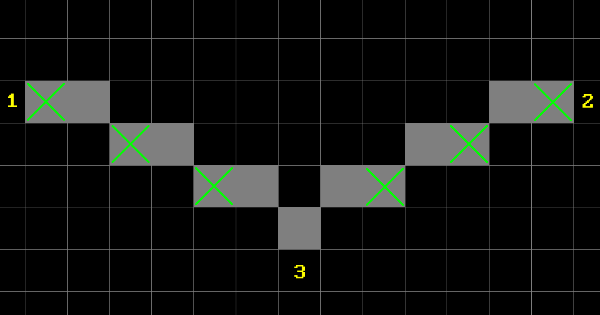

But consider the following configuration:

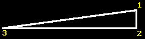

In this case there is an extremely gentle slope of one side of a triangle (1-3) which will have more points with the same $y$ compared to the other side (1-2) which has few points, all of which with different $y$. What this means is that if we just let the algorithm run and connect any two points across a scanline with the same $y$, we will overdraw this line multiple times, because edge 1-2 will have to wait several turns before point from edge 1-3 changes its $y$  coordinate.

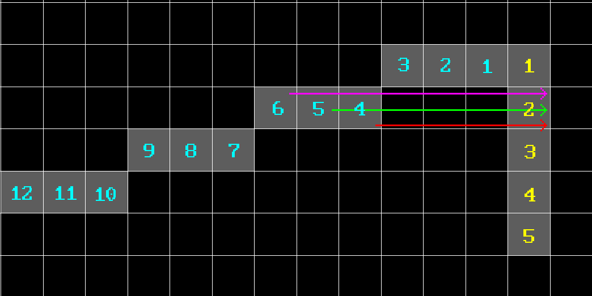

Yellow numbers represent points yielded by the right edge generator, while cyan are the ones yielded by the left one. As you can see, if we do nothing about, line to the yellow point number 2 will be drawn three times: 4-2 (red), 5-2 (green) and 6-2 (magenta). And similar thing will happen with the other points below. And if line is very slanted it will be even worse. And since we're doing it per pixel, that's a big waste. But there's also another thing.

Recall that our generator yields points across bresenham line. But depending on the type of the line their enumeration order (surprise-surprise!) will be different. I illustrated this by enumerating points yielded by left and right edge generators in green and cyan respectively:


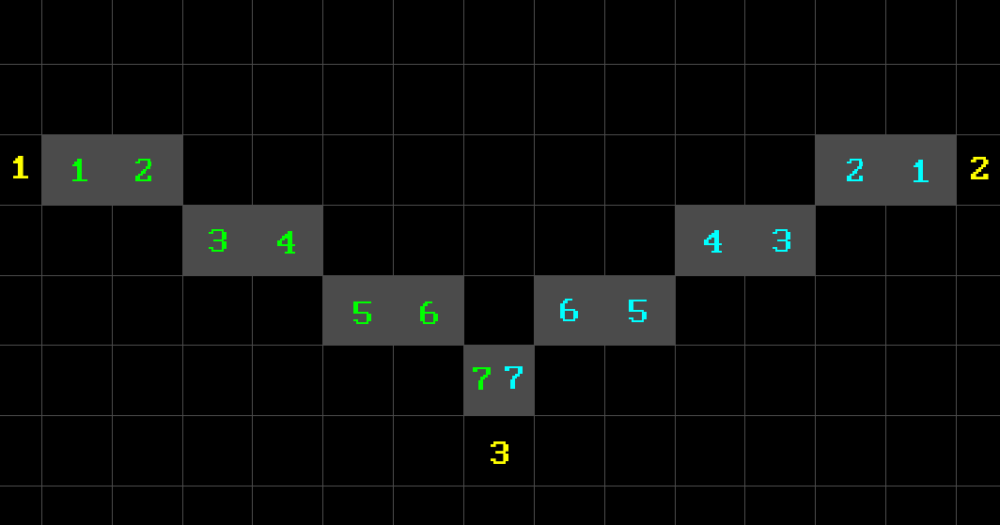

So that's why I introduced a concept of `PointCaptureType`, which determines what actual points do we need to connect at what situation. When we're drawing FB triangle our generators will produce points that go "outside", but in FT case they're going "inside". So we need to take "last" yielded point of a generator in FB case, and "first" one in FT, and only then connect them. Also we need to consider couple of edge cases when first point is far to the left or to the right compared to the other. In those cases we need to set one type of `PointCaptureType` for one line, and another for the other. I think you can get the idea from the illustration above, so I won't be drawing those (in fact I don't want to because it's tedious ;-P). For example, from FB case from the above illustration, position of point 1 for 1-3 can be either to the right of point 3 (as shown), in which case we need "last" yielded point from this generator, or to the left of point 3, in which case we need "first" yielded point. Same logic applies to the edge 1-2.

Let's finally look at the code now (I removed some of the comments to shorten the amount of lines):

```cpp
void Rasterize(BLG& first,
               BLG& second,
               const TriangleSimple& t,
               TriangleType tt)
{
  BLG::Point* p1 = first.Next();
  BLG::Point* p2 = second.Next();

  if (p1 == nullptr or p2 == nullptr)
  {
    return;
  }

  int x1 = p1->first;
  int x2 = p2->first;

  int y1 = t.Points[0].Y;
  int y2 = t.Points[0].Y;

  PointCaptureType ctLine1 = PointCaptureType::UNDEFINED;
  PointCaptureType ctLine2 = PointCaptureType::UNDEFINED;

  switch (tt)
  {
    case TriangleType::FLAT_BOTTOM:
    {
      //
      // For cases like:
      //
      // 1
      //
      //
      //     3     2
      //
      ctLine1 = (t.Points[2].X <= t.Points[0].X)
                ? PointCaptureType::LAST
                : PointCaptureType::FIRST;

      ctLine2 = (t.Points[1].X <= t.Points[0].X)
                ? PointCaptureType::FIRST
                : PointCaptureType::LAST;

      y2 = t.Points[1].Y;
    }
    break;

    case TriangleType::FLAT_TOP:
    {
      ctLine1 = (t.Points[2].X <= t.Points[0].X)
                ? PointCaptureType::LAST
                : PointCaptureType::FIRST;

      ctLine2 = (t.Points[2].X <= t.Points[1].X)
                ? PointCaptureType::FIRST
                : PointCaptureType::LAST;

      y2 = t.Points[2].Y;
    }
    break;
  }

  for (int currentScanline = y1; currentScanline <= y2; currentScanline++)
  {
    if (p1 != nullptr
    and p1->second == currentScanline
    and ctLine1 == PointCaptureType::FIRST)
    {
      x1 = p1->first;
    }

    while (p1 != nullptr and p1->second == currentScanline)
    {
      if (ctLine1 == PointCaptureType::LAST)
      {
        x1 = p1->first;
      }

      p1 = first.Next();
    }

    if (p2 != nullptr
    and p2->second == currentScanline
    and ctLine2 == PointCaptureType::FIRST)
    {
      x2 = p2->first;
    }

    while (p2 != nullptr and p2->second == currentScanline)
    {
      if (ctLine2 == PointCaptureType::LAST)
      {
        x2 = p2->first;
      }

      p2 = second.Next();
    }

    for (int x = x1; x <= x2; x++)
    {
      SDL_RenderDrawPoint(_renderer, x, currentScanline);
    }
  }
}
```

This method expects `first` and `second` to be the **left** and **right** edge of a corresponding triangle respectively in order for the for loop from `x1` to `x2` to work, so it will be lines 1-3 and 1-2 for FB triangle, and 1-3 and 2-3 for FT.

First we determine what kind of capture type we need. That can be determined quite easily because we can rely on specific order of incoming vertices. We also deal with special cases regarding different capture types as it was described above.

Then we start iterating across given scanlines, which are determined by `y1` and `y2`. We gather points from each of the generators until they change their $y$ and stop being equal to the current scanline value. After that we connect them, bearing in mind current point capture type to avoid overdraw.

And that's basically it.

I won't be listing other functions because they're basically wrappers with different input parameters. And besides I already kinda broke a promise I made to myself in the beginning by saying that I won't be pasting sheets of code here, but it couldn't be helped. XD

Please refer to the [example project](https://github.com/xterminal86/sw3d/tree/main/tests/scanline-rasterizer) for more detail.

You can use `TAB` to cycle through preset triangle types. Keys `1`, `2` and `3` are used to select individual triangle point and `WASD` to move it. By pressing `F` you can toggle between wireframe and filled modes to check out how composite triangle is actually split into basic ones.

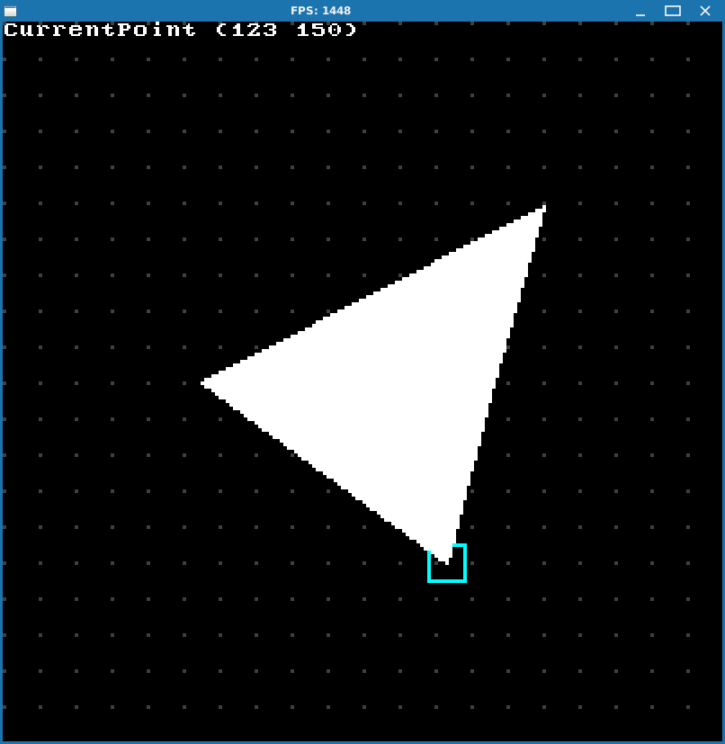 

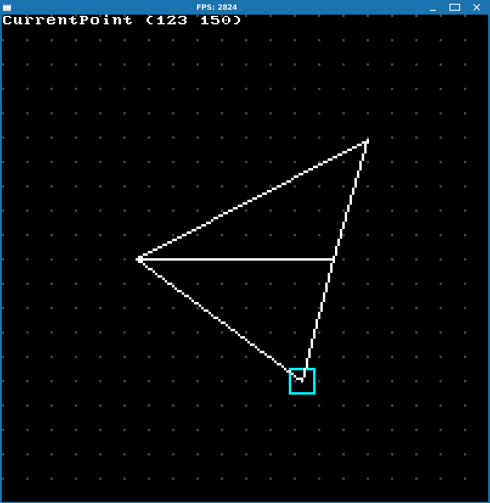

I kinda ran both of rasterizers described here and this one works a little bit faster than PIT rasterizer, which is expected, although maybe either one could be improved. But I think it's fine as it is.

There's one last important issue left to deal with before we can finally start drawing actual 3D stuff.

### Top-Left rule

Let's consider two triangles with the following points:

$$
\begin{align*}
Triangle_1 &=\{ (50, 50, 0),  (100, 50, 0), (50, 100, 0) \} \\
Triangle_2 &=\{ (100, 50, 0), (50, 100, 0), (100, 100, 0)\}
\end{align*}
$$

These two triangles have a common edge. Connected triangles like these are basically building blocks of any 3D model. So in this example they will look like this (I colored first one red and second one green):

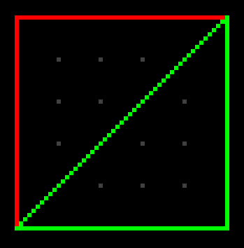

Now see what happens if we toggle out green triangle:

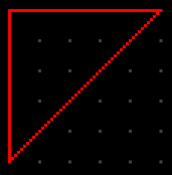

As you can see, since two triangles share an edge, it gets overdrawn by one of the triangles (green in this case). Now consider the following configuration:

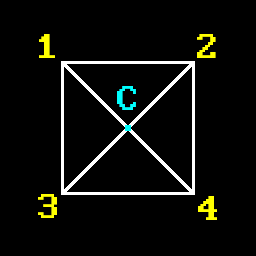

Here edges 1-C, 2-C, 3-C and 4-C will be drawn twice. So we have 4 triangles and 4 overdraws. Your average low-poly model could have 3-5k of triangles and theoretically you could have about that much edge overdraws. This is unacceptable.

Another more explicit issue comes with `blending`: blending actually relies on drawing order of triangles to properly blend colors, so if you overdraw edges you'll get incorrect results at that location, which will likely result in dark lines or something like that. Obviously, this will look bad and you don't want that.

So we need some kind of tie-breaking rule to avoid overdrawing of shared edge.

Enter `Top-Left Rasterization Rule` or `Top-Left Rule` for short.


TBC
