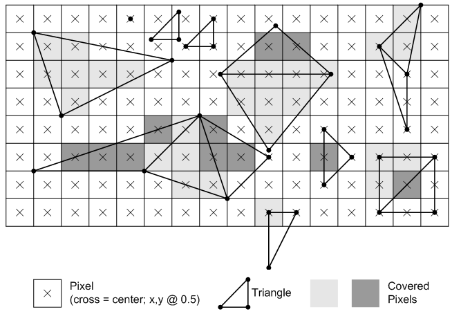

# TRIANGLE

> _"What is a man? A miserable little pile of secrets!"_
> 
> Dracula, "Castlevania: Symphony of the Night"

Indeed, what is a triangle? 

And why it's such a big deal? Can't you do 3D graphics without triangles?

Of course you can. 

For one, what we're trying to do here is called `rasterization`, as already mentioned in the "Line" chapter (you can also check [this](https://en.wikipedia.org/wiki/Rasterisation) Wikipedia article for more details), but there is another way of rendering 3D images called `ray tracing`. It actually _might_ be conceptually easier (there's well known local meme in computer graphics about how you can fit [raytracer code on a business card](https://fabiensanglard.net/rayTracing_back_of_business_card/)), but traditionally it's much more computationally expensive (even at the time of writing this), so that's why most of the time people use rasterization instead. Please research this topic yourself, if you like. You can start, for example, [here](https://blogs.nvidia.com/blog/whats-difference-between-ray-tracing-rasterization/). 

From the rasterization point of view, one notable example is [Sega Saturn](https://en.wikipedia.org/wiki/Sega_Saturn) that used **quads** instead of triangles to render 3D. This doesn't mean that Sega Saturn couldn't draw triangles - it just used quad as its main rendering primitive. And before you start wondering, it was backed by none other than Nvidia back then. I'm pretty sure that [earliest examples of 3D graphics](https://www.youtube.com/watch?v=fAhyBfLFyNA) also used triangles (well, for the most part at least, as far as I can tell from the video). So why rectangles then? Well, one of the explanations is that this was done to achieve performance in drawing of tile-based scenes, i.e. 2D sprites. It was sort of an inertia from the times of [NES](https://en.wikipedia.org/wiki/Nintendo_Entertainment_System) and [SNES](https://en.wikipedia.org/wiki/Super_Nintendo_Entertainment_System), which used tile-based rendering of sprites.

But eventually everybody kinda silently agreed upon triangles and for obvious reason: it's the simplest polygon possible. Triangle is unambiguously defined by any 3 points and they always reside on the same plane in space, while with quads you could get for example this:


So now we know that any 3D model (no matter how fancy) is actually consisting of lots of triangles. Thus, before we start drawing such 3D models we need to learn how to draw triangles first. Given three points on a screen we need to somehow decide which pixels to light up so that the area of a triangle looks filled.


To do that we're going to implement what's called `scanline rasterization` method: we will traverse triangle from top to bottom and connect with a horizontal line two points on triangle's left and right edges, hence the name `scanline`. Fast and easy.

## Scanline rasterizer

If you actually think about it, aside from degenerate cases like a line or a point, any triangle can belong to one of the three categories, one of which can be further divided into two more. But both of them contain previous two (I marked it with a dashed line for clarity), so we have four categories in total:


We will call these:

1. **Flat Top (FT)** triangle

2. **Flat Bottom (FB)** triangle

3. **Composite Major Right (CMR)** triangle

4. **Composite Major Left (CML)** triangle

As you can clearly see, CMR and CML triangles consist of FB and FT triangles (let's call them `basic triangles`) if looking from top to bottom. Thus, in general every non-degenerate triangle can be represented with FT or FB triangles. So what we need to do is find out which type of triangle is before us and then perform our scanline rasterization by filling in pixels going left to right, top to bottom across triangle's edges, like so (FB triangle shown):


To do that we will use our old friend from previous chapter - `Bresenham algorithm`. Remember earlier I said that we will use it, but a bit indirectly? What I meant is that we're not going to use it to draw lines with it - we're going to use it to get points across edges of corresponding triangle, and then we will connect them horizontally at each $Y$ pixel position.

Let's recall that our line drawing algorithm has certain quirk, so to speak: it swaps points depending on the line's slope. And the side effect of this is that our first point might be either above or below the second:


But since we're planning on doing scanline rasterization, it would be more convenient to always have first point above the second. That's actually easy to do - we just need to sort line points by $Y$ instead of $X$ and then basically swap everything inside the algorithm. I'll leave that as an excercise to the reader. Start with the similar setup as the original one, but this time consider line with steep slope as your "base case", and then just follow along with the whole line of thinking from previous chapter again and you'll be fine.

And to make our life easier let's wrap that in generator-like class that is initialized with start and end points, and returns next point for a potential line when called, like this: 

```cpp
BLG bg;

bg.Init(x1, y1, x2, y2);

BLG::Point* p = bg.Next();
while (p != nullptr)
{
  printf("(%d, %d)\n", p->first, p->second);
  p = bg.Next();
}
```

See implementation and example [here](https://github.com/xterminal86/sw3d/tree/main/tests/bresenham-generator).

Then we can use two instances of such class to create two generators that will return corresponding points of a triangle's edges that we need to connect.

Now that we've prepared everything, let's continue with the triangle. There will be quite a lot of written text onwards, but I think that will be a great example of how a problem that is simple at first glance becomes overgrown with lots of details that you might've not known or thought about.

Now, since we have only four different possible triangles, let's enumerate their vertices. Because we're going to use vertices in calculations we need to be able to address them somehow, right? Which brings us to the question of `winding order` again, because we need some kind of, well, order in which we're going to enumerate vertices. For example, should it be like this:


Or maybe this:


Or what if we "bit-shift" points across (first becomes second, second becomes third and third becomes first)? And this is just for one type of triangle. I guess theoretically you could just write code for every possible scenario, but that will be a nightmare and kinda unprofessional. Like, do we **really** have no choice but to manually go through all possible cases? Spoiler alert: of course not. So let's think about it.

Recall that a little bit earlier we made a generator class that produces points for a line that always start from the top? We did that because for scanline rasterization it's natural to always start from the top. This fact actually narrows down possible configuration of vertices: our first point of any triangle will always be at the top. So that leaves the question of how we enumerate the rest - `CW` or `CCW`?

Let's pick `CW` order because it seems that it's the one that is used across all learning materials that I encountered regarding this topic. And honestly CW is kinda more easy to the mind: on the screen (0;0) is at the top-left corner and x and y go left to right, top to bottom, so CW ordering feels more natural here. Also, as a bonus, by sticking to CW order we will shorten amount of additional swap operations, as you'll see later.

Sure, one could say that by choosing the same winding order for both 2D and 3D we would attain sort of a consistency (that's actually exactly what I contemplated about for a bit), but it really _is_ just a matter of preference, and winding order for 3D is not related **at all** to the order that we can choose for 2D rasterization, so let's not make our life harder than it already is. ;-) But if you do want to complicate your life and choose another winding, you probably already guessed that you would just need to "flip everything" around that is shown in the example.

So, it would be great if we could "convert" any given three vertices to only one configuration that we can work with. Let recall our four possible triangles again:


Actually, by sorting vertices $Y$ first and $X$ second, they will position themselves like so:


Which is almost what we need. All that is left for us to do is to perform only one swap of vertices `2` and `3` for `FB` triangle: 


In order to draw composite triangles we can always just manually specify proper order for their FT and FB triangles that they consist of. And that's it, we have our enumeration order:

```
FT  - 1, 2, 3
FB  - 1, 2, 3
CMR - [ (1, x, 3), (3, x, 2) ]
CML - [ (1, 2, x), (x, 2, 3) ] 
```

We still need to find splitting point `x` to be able to rasterize composite triangle using two basic ones.

Let's look at CMR triangle more closely:


We can observe that triangles `1CX` and `1n2` are similar. From this fact we can express similarity ratio:

$$
\frac{v_3.y-v_1.y}{v_2.y-v_1.y}=r
$$

Obviously, $X.y=v_3.y$ and $n.x=v_1.x$.

~~Ab~~using the same similarity property we can also write:

$$
\frac{X.x-v_1.x}{v_2.x-v_1.x}=r
$$

Which allow us to equate both expressions:

$$
\frac{X.x-v_1.x}{v_2.x-v_1.x}=\frac{v_3.y-v_1.y}{v_2.y-v_1.y}
$$

From which we can express $X.x$ by cross-multiplication:

$$
\begin{align*}
(X.x-v_1.x)(v_2.y-v_1.y)&=(v_3.y-v_1.y)(v_2.x-v_1.x) \\
X.x-v_1.x&=\frac{(v_3.y-v_1.y)(v_2.x-v_1.x)}{(v_2.y-v_1.y)} \\
X.x&=v_1.x+\frac{(v_3.y-v_1.y)}{(v_2.y-v_1.y)}(v_2.x-v_1.x)
\end{align*}
$$

$$
\boxed{X.x=v_1.x+r(v_2.x-v_1.x)}
$$

OK, so to outline our steps, for any given triangle we do the following:

1. Sort vertices Y first and X second.

2. Check if triangle has CCW winding. If it does then it's a FB triangle and in that case we need to swap its 2 and 3 vertices. Otherwise do nothing.

3. Perform rasterization.

How can we determine current winding order of a triangle? To do that we will ask for help from our another old friend - `cross product`. Let's again look carefully at this triangle:


To determine current winding order all we have to do is note that if we take a cross product of vectors 1-2 and 2-3, it will yield different sign depending on the order of vertices. 

```cpp
WindingOrder GetWindingOrder(const TriangleSimple& t)
{
  double cp = CrossProduct2D(t.Points[1] - t.Points[0],
                             t.Points[2] - t.Points[1]);

  return cp > 0 ? WindingOrder::CW : WindingOrder::CCW;
}
```

Where `WindingOrder` is just a simple `enum`:

```cpp
enum class WindingOrder
{
  CW = 0,
  CCW
};
```

This example triangle has CCW winding order, obviously, and we need CW. But you can see that winding order changes if we swap any of the two vertices:


So, after we find out winding order of a triangle, we can check if it's the one we need, and "fix" it if it's not. So let's put all of that in a helper function:

```cpp
void CheckAndFixWinding(TriangleSimple& t)
{
  WindingOrder wo = GetWindingOrder(t);
  if (wo == WindingOrder::CCW)
  {
    //
    // Since we decided to stick to CW winding order if we encountered CCW one
    // just swap two adjacent vertices to change it.
    // We will swap 2nd and 3rd because we decided on certain configurations
    // of vertices for all triangle types.
    //
    std::swap(t.Points[1].X, t.Points[2].X);
    std::swap(t.Points[1].Y, t.Points[2].Y);
  }
}
```

As you can see from the comment, we will swap second and third vertex and not just any random two, because, remember, that's the only case when we get CCW order after sorting - FB triangle, where we need to swap vertices 2 and 3.

> Just a side note: you can't determine winding order of a triangle in 3D space because there's always the "other" side, so whatever is CW looking from the "front", it's CCW looking from the "back". But here we're in 2D space, so there's no "other" side, and thus we're good.

And with that, here's how our main rasterization function looks like:

```cpp
void FillTriangleCustom(TriangleSimple& t)
{
  SortVertices(t);
  CheckAndFixWinding(t);

  TriangleType tt = GetTriangleType(t);
  switch (tt)
  {
    case TriangleType::VERTICAL_LINE:
      DrawVL(t);
      break;

    case TriangleType::HORIZONTAL_LINE:
      DrawHL(t);
      break;

    case TriangleType::FLAT_TOP:
      DrawFT(t);
      break;

    case TriangleType::FLAT_BOTTOM:
      DrawFB(t);
      break;

    case TriangleType::MAJOR_RIGHT:
      DrawMR(t);
      break;

    case TriangleType::MAJOR_LEFT:
      DrawML(t);
      break;

    default:
      break;
  }
}
```

We're also handling two edge cases here when triangle has degenerated into a line, but they're trivial to implement, so I won't be showing them here. Instead let's look at `DrawFT()` for rasterization of a flat top triangle:

```cpp
void DrawFT(const TriangleSimple& t)
{
  //
  // Vertices in 't' are always:
  //
  // 1     2
  //
  //
  //    3
  //
  BLG first;
  first.Init(t.Points[0].X, t.Points[0].Y, t.Points[2].X, t.Points[2].Y);

  BLG second;
  second.Init(t.Points[1].X, t.Points[1].Y, t.Points[2].X, t.Points[2].Y);

  if (Wireframe)
  {
    RasterizeWireframe(first, second, t, TriangleType::FLAT_TOP);
  }
  else
  {
    Rasterize(first, second, t, TriangleType::FLAT_TOP);
  }
}
```

As you can see, our sorting and widing fixing allowed us to rely on specific order of vertices that come into this function. Then we can prime two generators for two corresponding edges: 1-3 and 2-3. Again, you can see that there's another convenient method present for drawing wireframe triangle, but we're also going to skip it since it's trivial and not important for this topic.

Now, `Rasterize()` is where things get real. This function contains code for rasterization of both FT and FB triangles. But before checking it out we need to address another issue.

Generally it's obvious that during scanline rasterization loop we need to connect leftmost points of the left line with rightmost points of the right line, like so:


But consider the following configuration:


In this case there is an extremely gentle slope of one side of a triangle (1-3) which will have more points with the same $y$ compared to the other side (1-2) which has few points, all of which with different $y$. What this means is that if we just let the algorithm run and connect any two points, produced by generators, across a scanline with the same $y$, we will overdraw this line multiple times, because edge 1-2 will have to wait several turns before point from edge 1-3 changes its $y$  coordinate.


Yellow numbers represent points yielded by the right edge generator, while cyan are the ones yielded by the left one. As you can see, if we do nothing about, line to the yellow point number 2 will be drawn three times: 4-2 (red), 5-2 (green) and 6-2 (magenta). And similar thing will happen with the other points below. And if line is very slanted it will be even worse. And since we're doing it per pixel, that's a big waste. But there's also another thing.

Our generator yields points across Bresenham line. But depending on the type of the line their enumeration order (surprise-surprise! order again) will be different. I illustrated this by enumerating points yielded by left and right edge generators in green and cyan respectively:


So that's why I introduced a concept of `PointCaptureType`, which determines what actual points do we need to connect at what situation. When we're drawing FB triangle our generators will produce points that go "outside", but in FT case they're going "inside". So we need to take "last" yielded point of a generator in FB case, and "first" one in FT, and only then connect them. 

But unfortunately that's not all: for example point 3 in FB triangle can reside either to the left of point 1 or to the right. I don't want to draw the picture again, but you can actually see it from the existing picture of FB triangle above: just imagine that point 2 is way to the right offscreen and point 3 is located where point 2 is on the picture. This will be the case when point 3 is located to the right of point 1. The same goes for point 2 as well and you can also kinda see it from the existing picture by applying the described method but "the other way around". 

This will change capture type that we need to use for those cases, so we need to take them into account as well. It's not hard or anything, it's just a little bit of a hassle, because you had to add couple of conditional checks. The same logic applies to FT triangle and its vertices.

Let's finally look at the code now (I removed some of the comments to shorten the amount of lines):

```cpp
void Rasterize(BLG& first,
               BLG& second,
               const TriangleSimple& t,
               TriangleType tt)
{
  BLG::Point* p1 = first.Next();
  BLG::Point* p2 = second.Next();

  if (p1 == nullptr or p2 == nullptr)
  {
    return;
  }

  int x1 = p1->first;
  int x2 = p2->first;

  int y1 = t.Points[0].Y;
  int y2 = t.Points[0].Y;

  PointCaptureType ctLine1 = PointCaptureType::UNDEFINED;
  PointCaptureType ctLine2 = PointCaptureType::UNDEFINED;

  switch (tt)
  {
    case TriangleType::FLAT_BOTTOM:
    {
      //
      // For cases like:
      //
      // 1
      //
      //
      //     3     2
      //
      ctLine1 = (t.Points[2].X <= t.Points[0].X)
                ? PointCaptureType::LAST
                : PointCaptureType::FIRST;

      ctLine2 = (t.Points[1].X <= t.Points[0].X)
                ? PointCaptureType::FIRST
                : PointCaptureType::LAST;

      y2 = t.Points[1].Y;
    }
    break;

    case TriangleType::FLAT_TOP:
    {
      ctLine1 = (t.Points[2].X <= t.Points[0].X)
                ? PointCaptureType::LAST
                : PointCaptureType::FIRST;

      ctLine2 = (t.Points[2].X <= t.Points[1].X)
                ? PointCaptureType::FIRST
                : PointCaptureType::LAST;

      y2 = t.Points[2].Y;
    }
    break;
  }

  for (int currentScanline = y1; currentScanline <= y2; currentScanline++)
  {
    if (p1 != nullptr
    and p1->second == currentScanline
    and ctLine1 == PointCaptureType::FIRST)
    {
      x1 = p1->first;
    }

    while (p1 != nullptr and p1->second == currentScanline)
    {
      if (ctLine1 == PointCaptureType::LAST)
      {
        x1 = p1->first;
      }

      p1 = first.Next();
    }

    if (p2 != nullptr
    and p2->second == currentScanline
    and ctLine2 == PointCaptureType::FIRST)
    {
      x2 = p2->first;
    }

    while (p2 != nullptr and p2->second == currentScanline)
    {
      if (ctLine2 == PointCaptureType::LAST)
      {
        x2 = p2->first;
      }

      p2 = second.Next();
    }

    for (int x = x1; x <= x2; x++)
    {
      SDL_RenderDrawPoint(_renderer, x, currentScanline);
    }
  }
}
```

This method expects `first` and `second` to be the **left** and **right** edge of a corresponding triangle respectively in order for the for loop from `x1` to `x2` to work, so it will be lines 1-3 and 1-2 for FB triangle, and 1-3 and 2-3 for FT.

First we determine what kind of capture type we need. That can be determined quite easily because we can rely on specific order of incoming vertices. We also deal with special cases regarding different capture types as it was described above.

Then we start iterating across given scanlines, which are determined by `y1` and `y2`. We gather points from each of the generators until they change their $y$ and stop being equal to the current scanline value. After that we connect them, bearing in mind current point capture type to avoid overdraw.

And that's basically it.

I won't be listing other functions because they're basically wrappers with different input parameters. And besides I already kinda broke a promise I made to myself in the beginning by saying that I won't be pasting sheets of code here, but it couldn't be helped. XD

Please refer to the [example project](https://github.com/xterminal86/sw3d/tree/main/tests/scanline-rasterizer) for more detail.

You can use `TAB` to cycle through preset triangle types. Keys `1`, `2` and `3` are used to select individual triangle point and `WASD` to move it. By pressing `F` you can toggle between wireframe and filled modes to check out how composite triangle is actually split into basic ones.

 


OK, it's all well and good but there's one last important issue left to deal with before we can finally start drawing actual 3D stuff.

## Fill Convention

Let's consider two triangles with the following points:

$$
\begin{align*}
Triangle_1 &=\{ (50, 50, 0),  (100, 50, 0), (50, 100, 0) \} \\
Triangle_2 &=\{ (100, 50, 0), (50, 100, 0), (100, 100, 0)\}
\end{align*}
$$

These two triangles have a common edge. Connected triangles like these (called `mesh`) are basically building blocks of any 3D model. So in this example they will look like this (I colored first one red and second one green):


Now see what happens if we toggle out green triangle:


As you can see, since two triangles share an edge, it gets overdrawn by one of the triangles (green in this case). Now consider the following configuration:


Here edges 1-C, 2-C, 3-C and 4-C will be drawn twice. So we have 4 triangles and 4 overdraws. Your average low-poly model could have 3-5k of triangles and theoretically you could have about that much edge overdraws. This is unacceptable.

Another more explicit issue comes with `blending`: blending actually relies on drawing order of triangles to properly blend colors, so if you overdraw edges you'll get incorrect results at those locations, which will likely result in dark lines or something like that. Obviously, this will look bad and you don't want that.

Referring to the Wikipedia article on rasterization mentioned in the beginning, we need for rasterization to have two properties:

1. There should be no holes between adjacent triangles, so that the rasterized area is completely filled.

2. No pixel should be rasterized more than once.

So we need some kind of tie-breaking rule or `fill convention` to avoid overdrawing of shared edges. 

Enter `Top-Left Rasterization Rule` or `Top-Left Rule` for short.

Don't know about you, but when I started researching topic of software 3D rendering, this was the first time I learned about existence of such rule. Like, I never actually gave it any thought, because if you draw stuff with one color (and that's exactly what you're going to do in the beginning) everything looks fine. So you might think that, you know, everything works, and move on to next topics. And then imagine you get to blending and then suddenly everything breaks for some reason. Talking about small details...

Anyway, if you google "top left rasterization rule" up, you'll probably immediately stumble upon [this article](https://learn.microsoft.com/en-us/windows/win32/direct3d11/d3d10-graphics-programming-guide-rasterizer-stage-rules) and image:



In the article you'll find two rules that supposed to explain this whole "top-left rule":

> Any pixel center which falls inside a triangle is drawn; a pixel is assumed to be inside if it passes the top-left rule. The top-left rule is that a pixel center is defined to lie inside of a triangle if it lies on the top edge or the left edge of a triangle.
> 
> Where:
> 
> * A top edge, is an edge that is exactly horizontal and is above the other edges.
> 
> * A left edge, is an edge that is not exactly horizontal and is on the left side of the triangle. A triangle can have one or two left edges.

Well, alright, but consider:


Why one triangle has its corner pixel filled but the other doesn't (outlined in magenta)? The same question for ones outlined in cyan. If rightmost corner pixel is "top", so it's filled, then shouldn't the other left one also be filled since it's "left"?

Turns out that it looks like the definition from MS is [poorly worded](https://stackoverflow.com/questions/78684610/need-help-understanding-top-left-rasterization-rule).

Actually Wikipedia article on rasterization elaborates on this (emphasis is mine):

> Pixel is rasterized if and only if
> 
> 1. Its center lies completely inside the triangle. Or
> 2. Its center lies exactly on the triangle edge (or multiple edges in case of corners) that is **(or, in case of corners, all are)** either _top_ or _left_ edge.

So, let's do it.

Because we're not using subpixel precision, our pixel center always lies inside the triangle, so there goes the first point. And for the second it's actually super easy, because of our scanline rasterization method that we chose:

1. Draw left and top edge for FT triangle and don't draw right.

2. Draw left edge for FB triangle and don't draw right and bottom.

In other words, always draw leftmost point and don't draw rightmost and also don't draw last scanline and we will automatically adhere to this top-left rule.

Also, note that in this case we also need to always capture first yielded points from generators in all cases. Why? Suppose we have very slanted edge 1-2 of a FB triangle that goes left to right. It will have its capture type set to LAST. But it could contain different number pixels with the same Y coordinate depending on the slope. Not drawing just last pixel won't be enough: we will still draw all those 3, 4, 5 or whatever before it. So we can't know beforehand how many pixels do we need to "underdraw", if such word exists. And if this edge is a shared with another FB triangle to the right, for that one that will be a left edge 1-3 with capture mode set to FIRST. So your points will overlap. 


By always chosing FIRST we will ensure that shared edge will always consist of the same points and then our "underdrawing" of rightmost pixel will work. So we don't even need any `PointCaptureType` stuff in code.

```cpp
BLG::Point* p1 = first.Next();
BLG::Point* p2 = second.Next();

if (p1 == nullptr or p2 == nullptr)
{
  return;
}

int x1 = p1->first;
int x2 = p2->first;

int y1 = t.Points[0].Y;
int y2 = t.Points[0].Y;

switch (tt)
{
  case TriangleType::FLAT_BOTTOM:
    y2 = t.Points[1].Y;
    break;

  case TriangleType::FLAT_TOP:
    y2 = t.Points[2].Y;
    break;
}

for (int currentScanline = y1; currentScanline < y2; currentScanline++)
{
  //
  // Always get "first" point no matter the direction.
  //
  if (p1 != nullptr and p1->second == currentScanline)
  {
    x1 = p1->first;
  }

  while (p1 != nullptr and p1->second == currentScanline)
  {
    p1 = first.Next();
  }

  if (p2 != nullptr and p2->second == currentScanline)
  {
    x2 = p2->first;
  }

  while (p2 != nullptr and p2->second == currentScanline)
  {
    p2 = second.Next();
  }

  for (int x = x1; x < x2; x++)
  {
    bool isTop  = (tt == TriangleType::FLAT_TOP
               and currentScanline == y1
               and x >= x1);
    bool isLeft = (x >= x1);

    if (isTop or isLeft)
    {
      SDL_RenderDrawPoint(_renderer, x, currentScanline);
    }
  }
}
```


It _kinda_ works, but oviously there's a little problem: the result does not look very good. XD

Sure, it does fill triangles correctly in certain configurations, but in some edge cases we get artifacts like these (numbers in red are triangles that were hidden):


And there's nothing we can do about it actually. Because all these triangles start from one point and on top of that everything is super tight, somebody has to draw _somewhere_, while others have to skip it. At least If we draw all triangles the area gets filled uniformly without gaps and / or overdraws:


So I guess _maybe_ it works? At least for meshes?

There's only one way to check that. But to do that we need to kinda run ahead a little bit. Let's actually construct a simple quad with two triangles that have shared edge, project it and add ability to transform this quad by rotating in three dimensions. And then see what happens. Don't worry, we'll go over projection and transformations later, it's not important here. The point is to check that everything still gets drawn correctly after polygon undergoes transformation and its vertices end up at whatever locations they end up. Because later our triangles will be transformed constantly and in different ways, so it's better to check that they are rasterized correctly at the earliest stage of our 3D renderer, so that we don't stumble across this problem while researching said transformations and / or projection, for example, and then have to stop what we're doing and go and solve this rasterization problem. I wrote simple [test program](https://github.com/xterminal86/sw3d/tree/main/tests/rasterizer-bugs) that allows you to rotate said quad around three dimensions, and after quick testing we get:


Great, so it doesn't work.

## Depression Quest

I gotta be honest, this was very depressing moment. Of course, deep inside I was a little doubtful, because, c'mon, it can't just work at first try, right? Who do you think you are? But still, I had very high hopes for this approach and was confident that it will work. Like, how can it not? We implemented Bresenham line algorithm by using lots of math in the process, so that is, like, extremely substantiated. And we checked that it indeed works. Then we put that in generator so we can get those points iteratively - nothing fancy. We handled different capture type modes for generators, went over every possible edge case. So all was left to do is just to construct a loop, take out new points from generators until there are no more left, and connect them. We even checked that rasterization of a single triangle using this approach works for any kind of it. And since we're doing scanline rasterization we can super easy satisfy this top-left fill convention rule by not drawing rightmost and downmost pixel lines. And we're also working with integers all over the place, so there shouldn't be any rounding error induced artifacts or anything like that. 

So WHY?! Where did those gaps (called `dropouts` by the way) come from?! 

Was all of my work just in vain? And what should I do with these articles now?

After thinking about it for some time I had thoughts of just skipping this problem and write that "I couldn't do it" or something like that and go ahead with different rasterization method, but fortunately everything resolved positively in the end.

After some fiddling around I found out that in certain cases even overdraw version of the algorithm produces dropouts:


And dropouts happen to occur only if triangles are composite. Sure, it still was unstable meaning that in certain trivial setups it looked fine (see pictures of test case from previous part).

Well, after some mulling over it, I decided to check exactly what points does our generator produces when we have shared edge, because it looked as if this shared edge had different set of points for each triangle for some reason.
