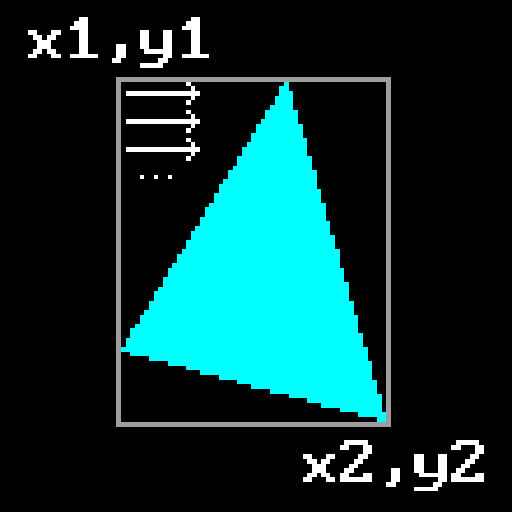
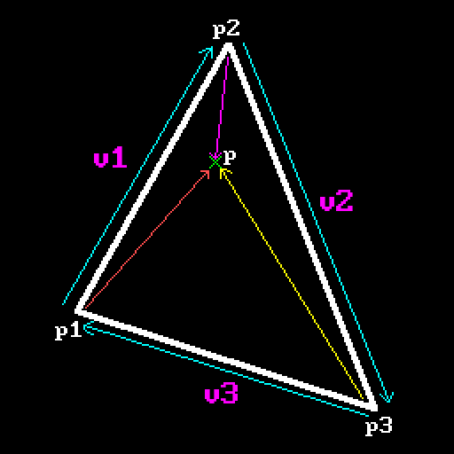
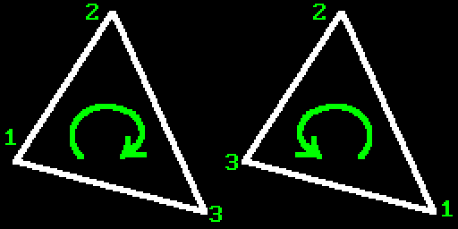
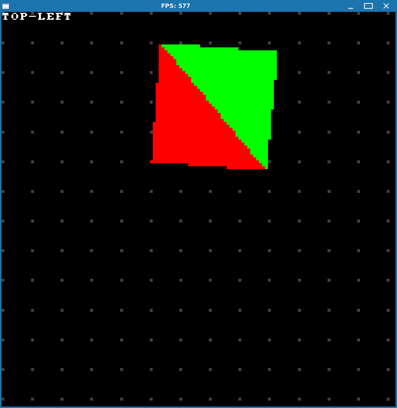
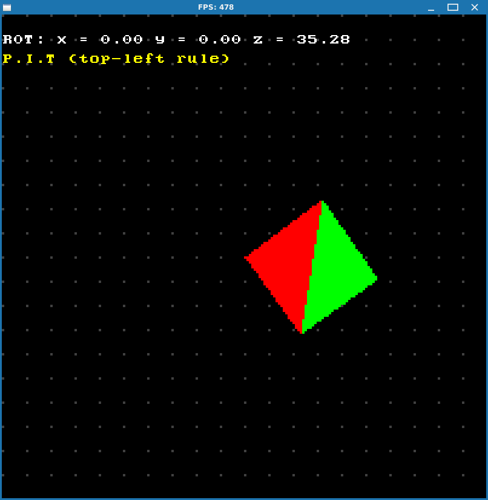
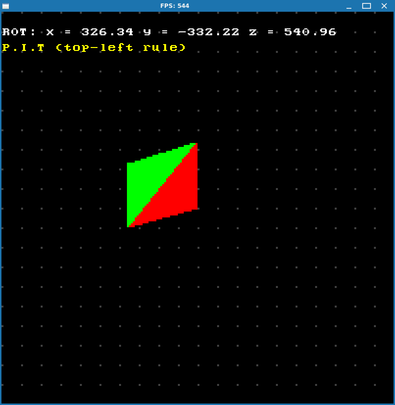

# SCANLINE IS A LIE

That's right, the whole idea of scanline rasterization being quick and simple because we just connect two points across scanline turns out to be one big deception. I will allow myself to quote the author from [this](https://fgiesen.wordpress.com/2013/02/10/optimizing-the-basic-rasterizer/) article which explains it best:

> If you’ve written any software rendering code in the past, chances are good that you used a scanline rasterization approach instead: you scan the triangle from top to bottom and determine, for each scan line, where the triangle starts and ends along the x axis. While the high-level overview is easy enough, the details get fairly subtle, as for example the [first](http://chrishecker.com/images/4/41/Gdmtex1.pdf) [two](http://chrishecker.com/images/9/97/Gdmtex2.pdf) articles from Chris Hecker’s 1995-96 series on perspective texture mapping explain (links to the whole series [here](http://chrishecker.com/Miscellaneous_Technical_Articles)).
> 
> More importantly though, this kind of algorithm is forced to work line by line. This has a number of annoying implications for both modern software and hardware implementations: the algorithm is asymmetrical in x and y, which means that a very skinny triangle that’s mostly horizontal has a very different performance profile from one that’s mostly vertical. The outer scanline loop is serial, which is a serious problem for hardware implementations. The inner loop isn’t very SIMD-friendly – you want to be processing aligned groups of several pixels (usually at least 4) at once, which means you need special cases for the start of a scan line (to get up to alignment), the end of a scan line (to finish the last partial group of pixels), and short lines (scan line is over before we ever get to an aligned position). Which makes the whole thing even more orientation-dependent. If you’re trying to do mip mapping at the same time, you typically work on “quads”, groups of 2×2 pixels (explanation for why is [here](https://fgiesen.wordpress.com/2011/07/10/a-trip-through-the-graphics-pipeline-2011-part-8/)). Now you need to trace out two scan lines at the same time, which boils down to keeping track of the current scan conversion state for both even and odd edges separately. With two lines instead of one, the processing for the starts and end of a scan line gets even worse than it already is. And let’s not even talk about supporting pixel sample positions that aren’t strictly on a grid, as for example used in multisample antialiasing. It all goes downhill fast. 

I'd say last sentence is a testament for the whole previous chapter.

So instead of scanline rasterization we will going to use much simpler approach, which I named `P.I.T. Rasterizer` after "Point Inside Triangle" test that is used by it. Maybe there's an official name for this method, but I don't know it. 

Also worth mentioning that in the above article author states that this approach to rasterization has been in use since late 80s. And [quick Google search](https://www.google.com/url?sa=t&source=web&rct=j&opi=89978449&url=https://research.nvidia.com/sites/default/files/pubs/2011-08_High-Performance-Software-Rasterization/laine2011hpg_paper.pdf&ved=2ahUKEwi3-vOOkv-JAxUwExAIHepgAAkQFnoECDEQAQ&usg=AOvVaw0aW6oI7L52-RYtiJ7wGktm) shows that it is an industry standard today. So your graphics card is doing this to rasterize your stuff, although on a hardware level and more sophisticated than what we're doing here, of course. It basically splits your framebuffer into tiles and deals with them on a per core basis (check out [this Wikipedia article](https://en.wikipedia.org/wiki/Tiled_rendering)) to maximize parallelization. One could say it's a blast from the NES era past, so to speak, who would've thought! But we have a saying here that says `everything new is a well forgotten old`.

## P.I.T. rasterizer

This method is very simple: given 3 points of a triangle we determine bounding box that surrounds it, and then iterate across it pixelwise, checking whether pixel falls inside the triangle or not.



To determine whether point falls inside the triangle or not we'll use already familiar tool to us - 2D cross product, that was introduced in previous chapter. In general cross product (along with dot product) is actually used quite often in computer graphics for different purposes. This is no exception: not only we can use it to determine winding order, but here we can also use it to determine whether a point lies inside the triangle or not. To do this we need to check the sign of a cross product of every triangle edge with a vector that goes from triangle vertex to the point in question.



$$
\begin{align*}
&w_0 = \vec{v_1}\times{\overrightarrow{red}} = \\
&= (p_2.x-p_1.x)*(p.y-p_1.y)-(p_2.y-p_1.y)*(p.x-p_1.x)\\
&w_1 = \vec{v_2}\times{\overrightarrow{magenta}} = \\ 
&= (p_3.x-p_2.x)*(p.y-p_2.y)-(p_3.y-p_2.y)*(p.x-p_2.x) \\
&w_2=\vec{v_3}\times{\overrightarrow{yellow}} = \\
&=(p_1.x-p_3.x)*(p.y-p_3.y)-(p_1.y-p_3.y)*(p.x-p_3.x)
\end{align*}

$$

You can see that if point lies inside the triangle, all cross products are performed "clockwise": edge multiplied by the vector to the point goes in sort of clockwise direction, so they all will have the same sign. Should a point lie outside the triangle, at least one of the products will go "different way" and will have opposite sign.

Let's again recall winding order real quick:



Since user can specify triangle vertices in any order, we can't pre-agree on certain sign of the cross product to check against. But since all that we need to do is check whether all products yield the same sign or not, this will work anyway.

So our main piece of code will look like this:

```cpp
for (int y = yMin; y <= yMax; y++)
{
  for (int x = xMin; x <= xMax; x++)  
  {
    SDL_Point p = { x, y };

    //
    // It seems that if we don't use a function call (CrossProduct2D) 
    // and just perform calculations directly, this way it works a 
    // little bit faster.
    //
    int w0 = (p2.x - p1.x) * (p.y - p1.y) - (p2.y - p1.y) * (p.x - p1.x);
    int w1 = (p3.x - p2.x) * (p.y - p2.y) - (p3.y - p2.y) * (p.x - p2.x);
    int w2 = (p1.x - p3.x) * (p.y - p3.y) - (p1.y - p3.y) * (p.x - p3.x);

    bool inside = (w0 <= 0 and w1 <= 0 and w2 <= 0)
               or (w0 >= 0 and w1 >= 0 and w2 >= 0);

    if (inside)
    {
      SDL_RenderDrawPoint(_renderer, p.x, p.y);
    }
  }
}
```

OK, now we can draw triangles all right. But just like with the case of scanline algorithm we need to implement fill convention here as well, otherwise we won't be able to draw things properly. Since now our rasterization approach is completely different (we go pixel by pixel across a rectangle), we need somehow to determine whether given pixel belongs to the edge or not and what kind of an edge is it. The rules are actually simple:

1. If edge is horizontal and above all others, then it's a **top** edge.

2. If and edge "goes up" (for CW winding order), then it's a **left** edge.


What this means is that we visit triangle vertices using our chosen winding order and find out an edge between these two points by subtracting one point from another. This will give us a vector and arrows on the picture show its direction. So for determining left edges we're interested in vectors that go up, i.e. ones whose Y component is negative, since for edges that go up we subtract bigger Y values from smaller ones. You can see that $v_1.y$ is obviously bigger than $v_2.y$, so if we subtract $v_2-v_1$ resulting vector will have its Y component negative.

And just to note: if winding order was CCW, than left edges were the ones that go down, so it's the classic "the other way around" principle.

To determine top edge it's even simpler: points that constitute such edge will end up setting zero in Y component of the resulting difference vector. And to distinguish this edge from the bottom one we also check that X component of difference vector is positive.

So here's how our top-left edge detection function looks like:

```cpp
bool PitRasterizerTLR::IsTopLeft(const SDL_Point& start, const SDL_Point& end)
{
  static Vec3 edge;
  edge.X = end.x - start.x;
  edge.Y = end.y - start.y;

  //
  // top edge is the one which has the same Y (hence egde.Y == 0) and
  // (edge.X > 0) to distinguish it from flat bottom. If we have consistent
  // winding order we will always have (edge.X > 0) for flat top and
  // (edge.X < 0) for flat bottom for CW winding order, and vice verca for CCW.
  //
  // If winding order were different (CCW), then everything would've been
  // "swapped" around: isTopEdge would have (edge.X < 0) and
  // isLeftEdge = (edge.Y > 0)
  //
  bool isTopEdge  = (edge.Y == 0) and (edge.X > 0);
  bool isLeftEdge = edge.Y < 0;

  return isTopEdge || isLeftEdge;
}
```

Now, how can this help us to ensure proper pixel coverage?

Actually it's dead simple. Because we're not using subpixel precision, all we have to do is force all pixels that do not belong to top or left edge out of our triangle. Remember earlier we implemented rasterization and mentioned that sign doesn't matter as long as it's consistent? It worked because we didn't care about vertex ordering: it all worked out automagically. There can only be one type of winding order, so no matter which one it happened to be, we will get either all negatives or all positives if pixel belongs to the triangle.

But now our situation is different. Now we need consistency and one step towards it is sticking to one winding order. And we chose CW. In this case point will be considered inside the triangle only if our `CrossProduct2D` returns positive value or zero. If our pixel landed on an edge that we don't want (for example right), we need to force this pixel out of triangle and not draw it. So what we do is test given pixel against three edges of a triangle and if it lands on top or left, we do nothing - pixel belongs to the triangle. But if not we add -1 to manually force the result of `CrossProduct2D` to become negative and thus skip this pixel. Again, value of -1 is enough to do that because we're not using subpixel precision and 1 is the smallest distance between two adjacent pixels.

Here's how part of the code looks like:

```cpp
...
int bias1 = IsTopLeft(p1, p2) ? 0 : -1;
int bias2 = IsTopLeft(p2, p3) ? 0 : -1;
int bias3 = IsTopLeft(p3, p1) ? 0 : -1;
...
for (int x = xMin; x <= xMax; x++)
{
  for (int y = yMin; y <= yMax; y++)
  {
    SDL_Point p = { x, y };

    int w0 = (p2.x - p1.x) * (p.y - p1.y) - (p2.y - p1.y) * (p.x - p1.x) + bias1;
    int w1 = (p3.x - p2.x) * (p.y - p2.y) - (p3.y - p2.y) * (p.x - p2.x) + bias2;
    int w2 = (p1.x - p3.x) * (p.y - p3.y) - (p1.y - p3.y) * (p.x - p3.x) + bias3;

    bool inside = (w0 >= 0 and w1 >= 0 and w2 >= 0);
    if (inside)
    {
      SDL_RenderDrawPoint(_renderer, p.x, p.y);
    }
  }
}
```

Let's test it on problematic cases from previous chapter:







Well, everything looks great, so we're done here!

But before we **finally** move into 3D world, let's also calculate `barycentric coordinates` while we're at it. We're going to use them later when we (hopefully) get to color interpolation and texture mapping.

## Barycentric coordinates

[GeoGebra](https://www.geogebra.org/m/c8DwbVTP)

WIP
