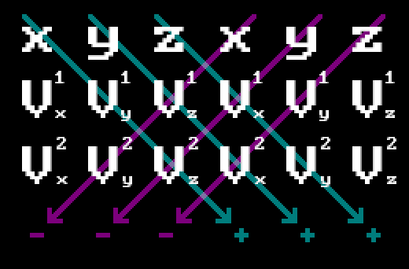
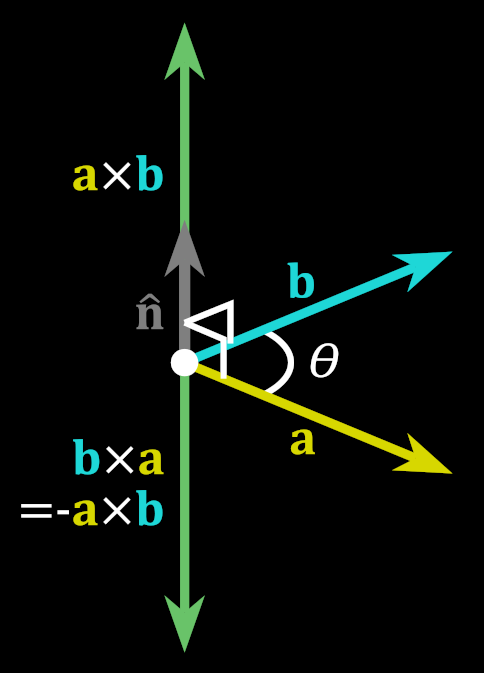

# SCANLINE IS A LIE

That's right, the whole idea of scanline rasterization being quick and simple because we just connect two points across scanline turns out to be one big deception. I will allow myself to quote the author from [this](https://fgiesen.wordpress.com/2013/02/10/optimizing-the-basic-rasterizer/) article which explains it best:

> If you’ve written any software rendering code in the past, chances are good that you used a scanline rasterization approach instead: you scan the triangle from top to bottom and determine, for each scan line, where the triangle starts and ends along the x axis. While the high-level overview is easy enough, the details get fairly subtle, as for example the [first](http://chrishecker.com/images/4/41/Gdmtex1.pdf) [two](http://chrishecker.com/images/9/97/Gdmtex2.pdf) articles from Chris Hecker’s 1995-96 series on perspective texture mapping explain (links to the whole series [here](http://chrishecker.com/Miscellaneous_Technical_Articles)).
> 
> More importantly though, this kind of algorithm is forced to work line by line. This has a number of annoying implications for both modern software and hardware implementations: the algorithm is asymmetrical in x and y, which means that a very skinny triangle that’s mostly horizontal has a very different performance profile from one that’s mostly vertical. The outer scanline loop is serial, which is a serious problem for hardware implementations. The inner loop isn’t very SIMD-friendly – you want to be processing aligned groups of several pixels (usually at least 4) at once, which means you need special cases for the start of a scan line (to get up to alignment), the end of a scan line (to finish the last partial group of pixels), and short lines (scan line is over before we ever get to an aligned position). Which makes the whole thing even more orientation-dependent. If you’re trying to do mip mapping at the same time, you typically work on “quads”, groups of 2×2 pixels (explanation for why is [here](https://fgiesen.wordpress.com/2011/07/10/a-trip-through-the-graphics-pipeline-2011-part-8/)). Now you need to trace out two scan lines at the same time, which boils down to keeping track of the current scan conversion state for both even and odd edges separately. With two lines instead of one, the processing for the starts and end of a scan line gets even worse than it already is. And let’s not even talk about supporting pixel sample positions that aren’t strictly on a grid, as for example used in multisample antialiasing. It all goes downhill fast. 

So instead of scanline rasterization we will going to use much simpler approach, which I named `P.I.T. Rasterizer` after "Point Inside Triangle" test that is used by it. Maybe there's an official name for this method, but I don't know it.

## P.I.T. rasterizer

This method is very simple: given 3 points of a triangle we determine bounding box that surrounds it, and then iterate across it pixelwise, checking whether pixel falls inside the triangle or not.


To determine whether point falls inside the triangle or not we'll use what's sometimes called `2D cross product`, but actually it's just a normal cross product with `Z` set to 0. One can easily memorize how to perform a cross product on two vectors if you'll associate the word `cross` with the following mnemonic:



Thus we will have:

$$
\vec{V_1} \times \vec{V_2} = (V^1_yV^2_z-V^1_zV^2_y,\;V^1_zV^2_x-V^1_xV^2_z,\;V^1_xV^2_y-V^1_yV^2_x)
$$

You can see that by setting z to 0 you'll be left with:

$$
\vec{V_1} \times \vec{V_2}=(0,\;0,\;V^1_xV^2_y-V^1_yV^2_x)
$$

Since right now we're doing 2D and not interested in this being interpreted as a 3D vector (you can think of it as a vector going outside / inside the screen, if you like), we can just use the last component as a scalar value:

```cpp
double CrossProduct2D(const Vec3& v1, const Vec3& v2)
{
  return (v1.X * v2.Y - v1.Y * v2.X);
}
```

Let's recall that the result of a cross product differs by sign depending on the order of operations:



We can use this fact to determine whether a point lies inside the triangle or not. To do this we need to check the sign of a cross product of every triangle edge with a vector that goes from triangle vertex to the point in question.


$$
\begin{align*}
&w_0 = \vec{v_1}\times{\overrightarrow{red}} = \\
&= (p_2.x-p_1.x)*(p.y-p_1.y)-(p_2.y-p_1.y)*(p.x-p_1.x)\\
&w_1 = \vec{v_2}\times{\overrightarrow{magenta}} = \\ 
&= (p_3.x-p_2.x)*(p.y-p_2.y)-(p_3.y-p_2.y)*(p.x-p_2.x) \\
&w_2=\vec{v_3}\times{\overrightarrow{yellow}} = \\
&=(p_1.x-p_3.x)*(p.y-p_3.y)-(p_1.y-p_3.y)*(p.x-p_3.x)
\end{align*}

$$

You can see that if point lies inside the triangle, all cross products are performed "clockwise": edge multiplied by the vector to the point goes in sort of clockwise direction, so they all will have the same sign. Should a point lie outside the triangle, at least one of the products will go "different way" and will have opposite sign.

Which actually brings us to the next important topic: `winding order`. This means the order in which triangle vertices are specified. It can either be in **clockwise** (`CW`) or **counterclockwise** (`CCW`) order.


Since user can specify triangle vertices in any order, we can't pre-agree on certain sign of the cross product to check against. But since all that we need to do is check whether all products yield the same sign or not, this will work anyway. But later you will see that winding order actually **does** matter.

So our main piece of code will look like this:

```cpp
for (int x = xMin; x <= xMax; x++)
{
  for (int y = yMin; y <= yMax; y++)
  {
    SDL_Point p = { x, y };

    //
    // It seems that if we don't use a function call (CrossProduct2D) 
    // and just perform calculations directly, this way it works a 
    // little bit faster.
    //
    int w0 = (p2.x - p1.x) * (p.y - p1.y) - (p2.y - p1.y) * (p.x - p1.x);
    int w1 = (p3.x - p2.x) * (p.y - p2.y) - (p3.y - p2.y) * (p.x - p2.x);
    int w2 = (p1.x - p3.x) * (p.y - p3.y) - (p1.y - p3.y) * (p.x - p3.x);

    bool inside = (w0 <= 0 and w1 <= 0 and w2 <= 0)
               or (w0 >= 0 and w1 >= 0 and w2 >= 0);

    if (inside)
    {
      SDL_RenderDrawPoint(_renderer, p.x, p.y);
    }
  }
}
```

And there you have it - perfectly working triangle rasterization method. As you can see it's very simple and straightforward. Check [example project](https://github.com/xterminal86/sw3d/tree/main/tests/pit-rasterizer) to see how it works.
